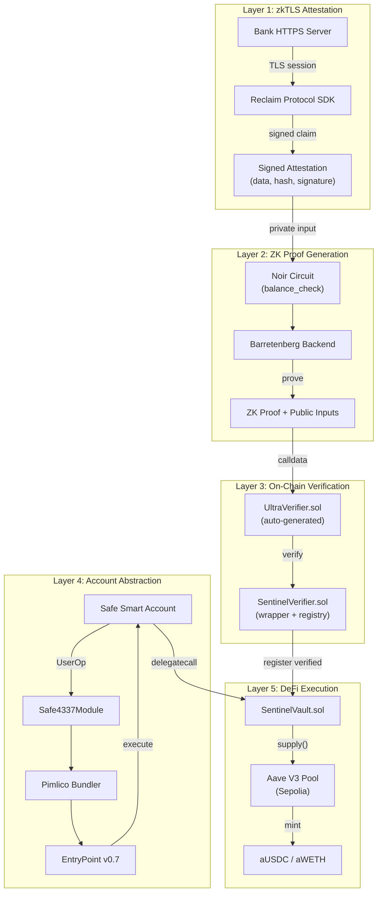
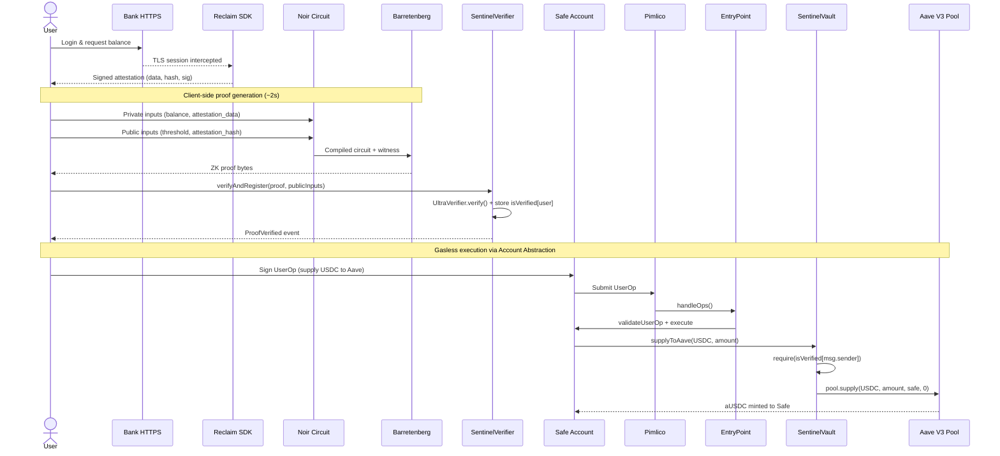
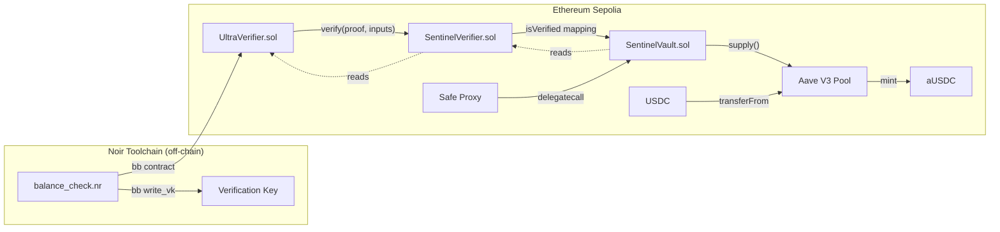

# Project Sentinel - Architecture Overview

> Privacy-preserving bridge from Web2 financial data to on-chain DeFi.

## System Overview

Sentinel is built as a **5-layer pipeline** where each layer transforms trust from one domain to the next:

| Layer | Component | Role |
|-------|-----------|------|
| 1 | **zkTLS Attestation** | Proves bank data came from a real HTTPS session |
| 2 | **ZK Proof (Noir)** | Proves eligibility ("balance > threshold") without revealing the balance |
| 3 | **Smart Contracts** | Verifies the proof on-chain and gates access |
| 4 | **Account Abstraction (Safe)** | Provides gasless, user-friendly transaction execution |
| 5 | **DeFi (Aave V3)** | Executes the actual supply/borrow against verified users |

---

## System Architecture



---

## End-to-End Data Flow



---

## Smart Contract Interactions



**Contract deployment order:**
1. `UltraVerifier.sol` - auto-generated from Noir circuit
2. `SentinelVerifier.sol(ultraVerifier, threshold)` - wraps verifier + maintains trust registry
3. `SentinelVault.sol(sentinelVerifier, aavePool)` - gates Aave access to verified users

---

## Key Design Decisions

| Decision | Choice | Rationale |
|----------|--------|-----------|
| **zkTLS Provider** | TLSNotary (v0.1.0-alpha.14) | MPC-TLS browser extension + local verifier. Webhook-based verification avoids binary proof parsing. |
| **Signature verification** | Off-circuit (off-chain) | Keeps the Noir circuit small and fast (~2s proving). Attestation binding is via Pedersen hash of data. |
| **Hash function** | Pedersen (in-circuit) | Native to Noir/Barretenberg, much cheaper in-circuit than SHA-256. |
| **Public inputs** | 2 Fields (threshold + hash) | Using `Field` instead of `[u8; 32]` reduces public inputs from 34 to 2, saving ~64k gas. |
| **Smart Account** | Safe (1-of-1) | Full ERC-4337 support on Sepolia via `Safe4337Module`. Battle-tested, extensible. |
| **Target chain** | Ethereum Sepolia | Only testnet with full Aave V3 deployment + GHO token. Base Sepolia has no Aave. |
| **Bundler** | Pimlico | Free tier supports Sepolia. Compatible with Safe's `Safe4337Pack`. |
| **Trust registry** | Persistent mapping | `SentinelVerifier` stores `address => bool` on-chain. Verify once, use many times. |

---

## Trust Chain

The cryptographic binding flows unbroken from the bank's TLS session to the Aave transaction:

```
Bank TLS Session (sentinel-d75o.onrender.com, CA-signed cert)
  → MPC-TLS: Browser Extension + local Verifier co-participate in TLS handshake
    → Verifier witnesses session; sends webhook to backend (X-TLSN-Secret auth)
      → Backend stores webhook; client submits merged results[]
        → Backend subset-matches results to stored webhook → proof is verified
          → Backend signs Attestation (secp256k1, notary key)
            → POST /verify checks signature + balance threshold + tx consistency
              → isValid: true (data provably from a real TLS session)
                → ZK proof: "I know data D such that hash(D) = H and balance(D) > T"
                  → On-chain verification: UltraVerifier confirms proof validity
                    → SentinelVerifier registers address as verified
                      → SentinelVault gates Aave access to verified addresses only
                        → Aave V3 executes supply/borrow for the Safe account
```

**What is proven without revealing:**
- The user has a bank balance above a threshold (without revealing the exact balance)
- The data came from a legitimate TLS session (without revealing account details)
- The user's address is cryptographically linked to this proof (without revealing PII)

---

## Monorepo Structure

```
zk-credit/
├── circuits/                  # Noir ZK circuits
│   └── balance_check/
│       ├── Nargo.toml
│       ├── src/main.nr        # Circuit: balance > threshold + attestation binding
│       └── Prover.toml
├── contracts/                 # Solidity (Foundry)
│   ├── foundry.toml
│   ├── src/
│   │   ├── UltraVerifier.sol  # Auto-generated from Noir circuit
│   │   ├── SentinelVerifier.sol  # Proof verification + trust registry
│   │   └── SentinelVault.sol  # Aave integration, gated by verification
│   ├── script/                # Deployment scripts
│   └── test/                  # Foundry tests
├── app/                       # TypeScript application
│   ├── src/
│   │   ├── attestation/       # Reclaim SDK / mock attestation
│   │   ├── proof/             # Noir proof generation (noir_js + bb)
│   │   ├── aa/                # Safe + ERC-4337 + Pimlico
│   │   └── aave/              # Aave V3 interaction helpers
│   └── package.json
├── docs/                      # Architecture documentation
│   ├── architecture.md
│   └── architecture.excalidraw
└── specs/                     # Project specifications
    ├── initial-idea.md
    └── project-overview.md
```
