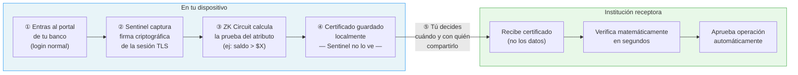
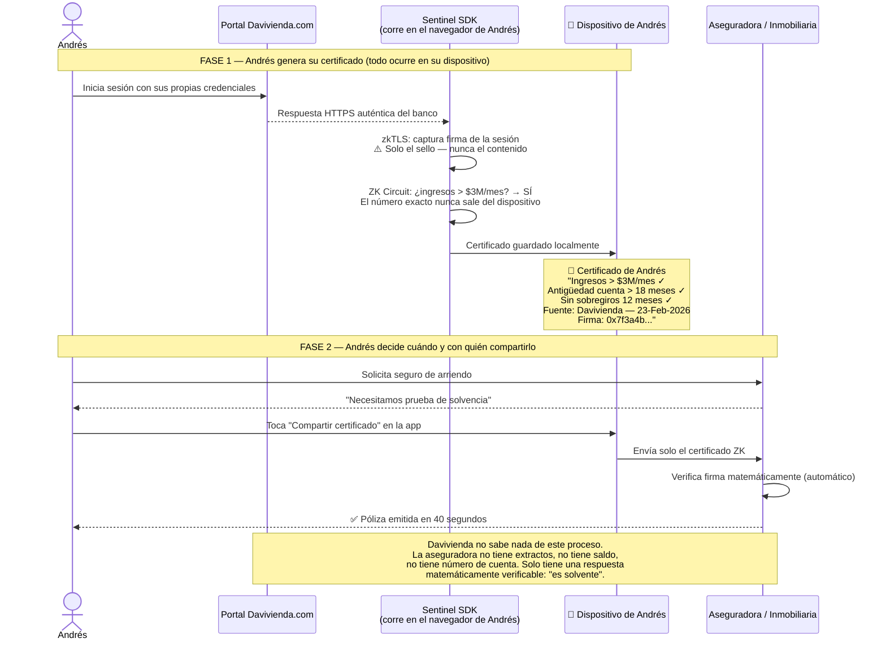
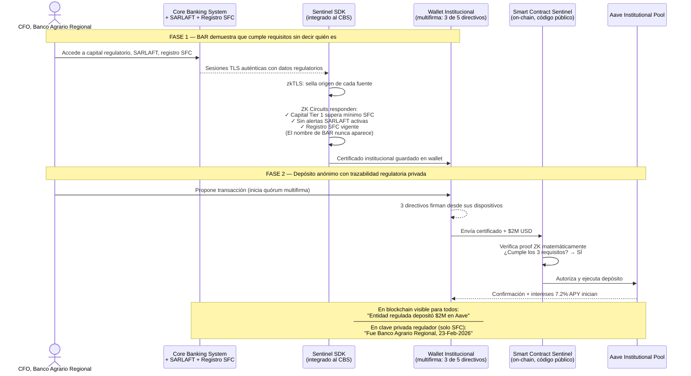
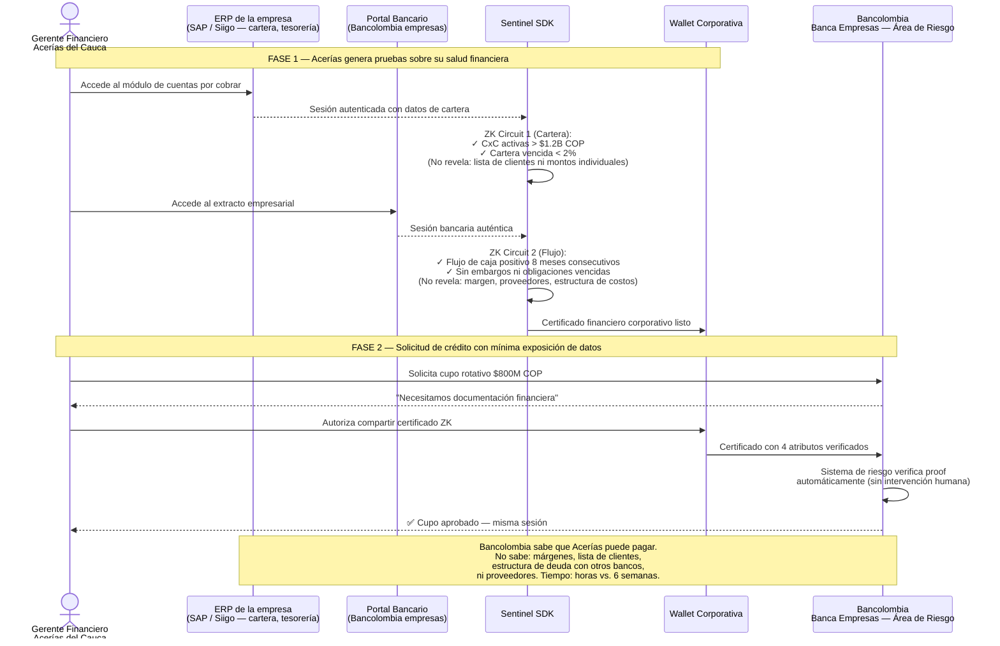
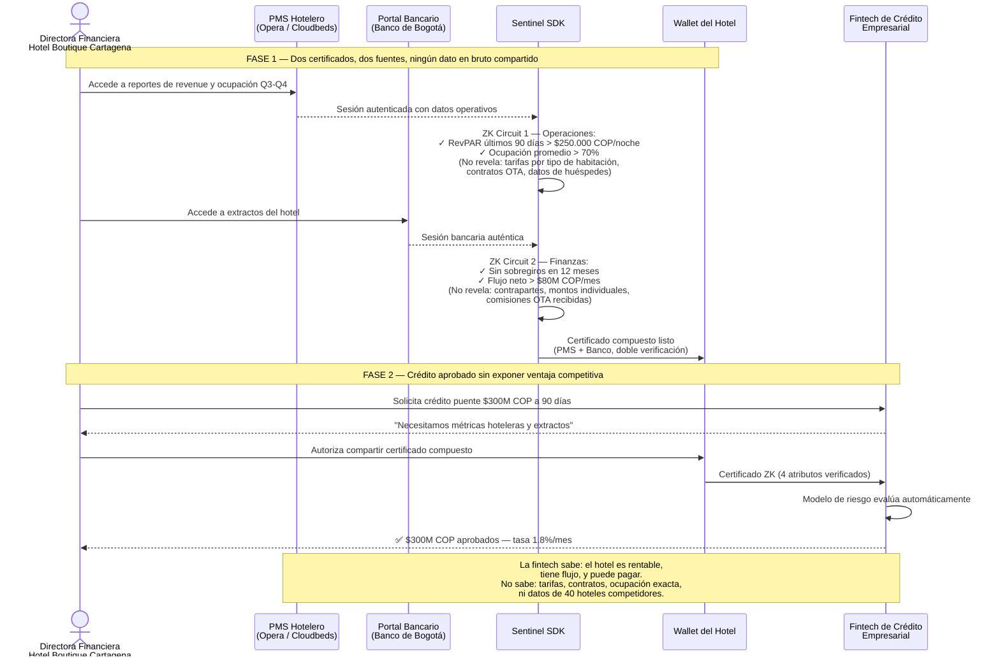

# Reporte de Oportunidad de Mercado: Project Sentinel v2

**Fecha de publicación:** 23 de febrero de 2026
**Versión:** 2.0 (Actualización estratégica — supersede v1 del 23-Feb-2026)
**Audiencia:** Equipo fundador, asesores, potenciales inversionistas seed
**Confidencial — Solo distribución interna**

---

## Índice

0. [Resumen Ejecutivo](#resumen-ejecutivo)
**P.** [¿Qué es Sentinel y cómo funciona?](#que-es-sentinel)
1. [La Visión: Capa de Identidad Financiera Universal](#la-vision)
2. [Definición y Segmentación del Mercado](#definicion-y-segmentacion)
3. [TAM Bottom-Up: Dos Mercados Paralelos](#tam-bottom-up)
4. [Validación Top-Down](#validacion-top-down)
5. [SAM: Mercado Servible por País](#sam)
6. [Panorama Competitivo](#panorama-competitivo)
7. [Marco Regulatorio por País](#marco-regulatorio)
8. [Modelo de Negocio](#modelo-de-negocio)
9. [SOM y Proyecciones Financieras](#som-y-proyecciones)
10. [Estrategia Go-to-Market](#go-to-market)
11. [Riesgos y Mitigación](#riesgos)
12. [Tesis de Inversión Seed](#tesis-de-inversion)

---

## 0. Resumen Ejecutivo {#resumen-ejecutivo}

Project Sentinel es una **capa de identidad financiera universal** que permite a cualquier institución financiera —banco, fintech, protocolo DeFi o aseguradora— verificar datos de sus contrapartes con garantías criptográficas, sin que nadie en el proceso vea información sensible. La tecnología central combina **zkTLS** (prueba de que un dato provino de una sesión HTTPS auténtica) con **Zero-Knowledge Proofs** (prueba de que ese dato cumple un criterio sin revelarlo) ejecutado on-chain vía Account Abstraction (ERC-4337).

El framing inicial del proyecto como "puente DeFi" suboptimiza la oportunidad. La visión más precisa es: **Sentinel es la infraestructura de cumplimiento de privacidad para la interoperabilidad financiera del siglo XXI**. DeFi institucional es un vertical dentro de un mercado mucho más grande.

### Métricas de Mercado

| Métrica | Valor | Base de Cálculo |
|---------|-------|-----------------|
| TAM — Open Banking Infra (Global) | $12.5B USD | Top-down: IDV + Open Banking + DeFi Compliance |
| TAM — ZK Identity Niche (Bottom-Up) | $720M USD | 40K instituciones × $120K ACV × 15% adopción ZK |
| SAM Total (5 países) | ~$705M USD | Bottom-up por país: LATAM 4 + EE.UU. |
| SOM Conservador (Año 5) | ~$24.7M ARR | 3.5% del SAM (~200 clientes activos) |
| SOM Optimista (Año 5) | ~$42.3M ARR | 6.0% del SAM (~350 clientes activos) |

### ¿Por qué ahora?

Cinco catalizadores convergen en 2026: (1) los circuitos ZK son finalmente viables para producción, (2) las leyes de Open Finance en LATAM crean demanda obligatoria de infraestructura de interoperabilidad, (3) la regulación de datos (LGPD, Ley 1581) eleva el costo de alternativas no-privadas, (4) el capital institucional busca acceso seguro al yield DeFi, y (5) ningún jugador existente combina zkTLS + ZK proofs con foco en datos financieros.

---

---

## P. ¿Qué es Sentinel y cómo funciona? {#que-es-sentinel}

*Esta sección es para lectores sin contexto técnico previo. Si ya conoces ZK proofs y zkTLS, puedes pasar a la Sección 1.*

---

### El problema en una frase

Cada vez que compartes datos financieros con alguien —una fintech, un banco, un arrendador— les estás dando una copia permanente de información que no deberían necesitar conservar.

Pides un crédito y envías tres meses de extractos bancarios. La fintech ve tu saldo exacto, tus pagos de Netflix, tu sueldo, tus deudas. Guarda todo. Tú ya no tienes control sobre esa información.

Sentinel resuelve esto. Permite demostrar lo que alguien necesita saber, **sin revelar nada más**.

---

### La analogía del sobre sellado con notario ciego

Imagina que necesitas demostrarle a un banco que tienes ingresos mayores a $3,000 al mes. Hoy lo haces enviando un PDF con todos tus movimientos bancarios.

Sentinel funciona diferente, como un **sobre sellado con notario ciego**:

1. **El notario ciego:** Sentinel genera un sello criptográfico que demuestra que cierta información vino directamente de tu banco (no de un PDF que tú modificaste). El notario certifica la autenticidad del sobre *sin leer su contenido*.

2. **La pregunta exacta:** En lugar de abrir el sobre, el banco le hace al notario una sola pregunta: "¿Los ingresos de esta persona superan $3,000 mensuales?" El notario responde Sí o No — con garantías matemáticas de que la respuesta es verdadera.

3. **La acción automática:** Si la respuesta es Sí, el banco aprueba la operación. El banco nunca vio tu extracto. Sentinel nunca vio tus datos. Nadie guardó una copia de nada.

Esto no es magia ni confianza en una empresa. Es matemática. La garantía es **criptográfica**, no institucional.

---

### ¿Cómo funciona? — El flujo en 5 pasos

El principio fundamental: **el certificado vive en tu dispositivo, no en los servidores de Sentinel ni en los del banco receptor. Tú controlas cuándo y con quién lo compartes.**



**Lo que sucede en cada paso:**

| Paso | Qué ocurre | Quién sabe qué |
|------|-----------|----------------|
| ① Login | Entras a tu banco normalmente, con tus credenciales propias | Solo tú y tu banco |
| ② zkTLS | Sentinel firma criptográficamente que esa respuesta vino del banco | Nadie ve el contenido |
| ③ ZK Proof | Se calcula si el atributo es verdadero (Sí/No), sin acceder al valor exacto | El circuito matemático |
| ④ Certificado | Se guarda en tu dispositivo como un archivo firmado | Solo tú lo tienes |
| ⑤ Compartir | Envías solo el certificado, no los datos | El receptor solo ve el atributo |

---

### Los 3 componentes técnicos, en lenguaje simple

**Componente 1: zkTLS — "El sello de origen"**

Cuando entras a la página web de tu banco, hay una conexión cifrada entre tu navegador y los servidores del banco (eso es el candado verde de HTTPS). Sentinel captura una "firma" de esa sesión que demuestra: *este dato vino de Bancolombia.com, en esta fecha, durante una sesión auténtica*. No captura tu contraseña, solo la respuesta que el banco le envió a tu navegador.

Es como un sello postal que prueba que una carta fue enviada desde una dirección real, en una fecha real.

**Componente 2: Zero-Knowledge Proof — "La respuesta sin revelar"**

Una vez que Sentinel tiene el dato sellado, genera una prueba matemática que responde una pregunta específica sobre ese dato *sin revelar el dato*. Por ejemplo: "¿El saldo es mayor a $10,000?" → Sí, y aquí está la prueba matemática de que es verdad.

Esta prueba puede ser verificada por cualquiera (un banco, un protocolo, un algoritmo) sin necesitar acceso al dato original. Es como una caja negra que solo produce respuestas verificables.

**Componente 3: Account Abstraction — "La ejecución sin intermediarios"**

Una vez que la prueba existe, puede gatillar acciones automáticamente en una red blockchain: depositar fondos, abrir una línea de crédito, completar un onboarding. Sin formularios. Sin humanos que revisen documentos. Sin esperas de 48 horas.

---

### ¿Cómo funciona en la práctica? — 4 flujos detallados

---

#### Caso 1: Persona natural — Seguro de arriendo con certificado Davivienda

**El problema hoy**

Andrés lleva 4 años como cliente de Davivienda, tiene ingresos estables de $4.2M al mes, nunca ha tenido un sobregiro, y quiere arrendar un apartamento de $2.8M en Bogotá. La inmobiliaria le pide, como es estándar, un "estudio de crédito": extractos bancarios de los últimos 3 meses y un certificado laboral.

Andrés los descarga en PDF y los envía por correo electrónico.

En ese momento ocurre algo que casi nadie nota: Andrés acaba de perder el control de su información financiera. El PDF llegó al buzón del asesor comercial de la inmobiliaria, que lo reenvió a la aseguradora, que lo guardó en un servidor propio. En ese PDF están sus movimientos completos: cuánto gastó en supermercado, en qué restaurantes come, si paga mesadas, si tiene deudas con otras entidades, el nombre exacto de su empleador y su salario preciso.

La inmobiliaria no necesitaba saber nada de esto. Solo necesitaba saber una cosa: *¿Andrés puede pagar el arriendo?*

---

**Cómo lo resuelve Sentinel**

Con Sentinel, el proceso cambia completamente porque hay una idea central diferente: **el certificado nace en el dispositivo de Andrés, no en los servidores de nadie más, y Andrés decide cuándo mostrarlo y a quién.**

Esto es lo que sucede paso a paso:

**Paso 1 — Andrés entra a Davivienda normalmente**
Andrés abre el portal de Davivienda en su navegador, igual que siempre. Escribe su usuario y contraseña. Nadie más interviene en este momento. Sentinel no ve sus credenciales.

**Paso 2 — Sentinel captura la "firma" de la respuesta del banco**
Cuando Davivienda responde a Andrés con sus datos (saldos, movimientos, etc.), Sentinel —que corre como una extensión en el navegador— captura una firma criptográfica de esa respuesta. Esta firma es como un sello notarial digital que dice: *"este dato provino de Davivienda.com, en esta fecha, en una sesión auténtica"*. Sentinel captura el sello, no el contenido.

**Paso 3 — Se genera la prueba matemática**
Con ese sello, Sentinel ejecuta un cálculo matemático (un circuito ZK) que responde la pregunta: *¿los ingresos de Andrés superan $3M/mes durante los últimos 3 meses?* La respuesta es Sí o No. El cálculo ocurre dentro del dispositivo de Andrés. Ni Sentinel ni ningún servidor externo ve el número exacto.

**Paso 4 — El certificado se guarda en el dispositivo de Andrés**
El resultado es un archivo pequeño: el certificado. Dice algo como: *"Ingresos mensuales superan $3M. Antigüedad de cuenta mayor a 18 meses. Sin sobregiros en 12 meses. Verificado desde Davivienda el 23 de febrero de 2026. Firma criptográfica: 0x7f3a…"* Este archivo vive en el teléfono o computador de Andrés, no en ningún servidor de Sentinel.

**Paso 5 — Andrés comparte solo ese certificado, cuando quiera**
Cuando la inmobiliaria le pide prueba de solvencia, Andrés abre la app de Sentinel, ve sus certificados guardados, y con un toque autoriza enviar este específico. La aseguradora recibe el certificado, verifica la firma criptográfica en segundos (es una verificación matemática automática, como verificar que una firma digital es válida), y aprueba la póliza.

La inmobiliaria nunca supo en qué banco tiene cuenta Andrés. La aseguradora nunca supo cuánto gana exactamente. Nadie guardó una copia de sus extractos. Si Andrés quiere, puede borrar el certificado después de usarlo.



**Antes vs. después**

| | Sin Sentinel | Con Sentinel |
|---|---|---|
| Documentos que Andrés entrega | Extractos 3 meses + cert. laboral en PDF | Un certificado ZK |
| Qué ve la aseguradora | Saldo exacto, movimientos, nombre del empleador, salario | Solo "ingresos > $3M/mes = Sí" |
| Tiempo del proceso | 2-5 días hábiles | 40 segundos |
| Quién guarda sus datos | La aseguradora y la inmobiliaria, indefinidamente | Nadie (el certificado lo tiene Andrés) |
| Riesgo si hackean a la aseguradora | Sus datos financieros quedan expuestos | No hay nada que robar |
| Control de Andrés sobre su info | Ninguno después de enviar | Total — puede revocar o borrar |

---

#### Caso 2: Institución financiera — Banco regional accede a yield DeFi

**El problema hoy: dinero dormido y una blockchain que todo lo ve**

Banco Agrario Regional (BAR) tiene en su cuenta de reservas $2 millones de dólares que no están trabajando. Este dinero —llamado *idle cash* o liquidez ociosa— es plata que el banco no necesita para operaciones inmediatas y que podría estar generando rendimiento.

Hoy, la opción más común para ese dinero es un CDT (Certificado de Depósito a Término) en otro banco, que en 2026 rinde aproximadamente **1.8% anual**. Con $2M USD, eso son $36,000 dólares al año.

Existe otra opción que el equipo financiero de BAR conoce: **Aave**, un protocolo DeFi (finanzas descentralizadas) que funciona como un banco de préstamos automatizado. Aave toma depósitos de instituciones y los presta a otros usuarios, pagando a los depositantes un interés. En 2026, la tasa para depósitos en USDC (un dólar digital) es **7.2% anual**. Con $2M USD, eso son $144,000 dólares al año.

La diferencia es $108,000 dólares anuales. Por hacer lo mismo: depositar dinero y esperar.

El equipo de tesorería de BAR quiere hacerlo. El equipo de compliance lo bloquea. ¿Por qué?

**El problema de la blockchain pública**

Una blockchain es como un libro contable que cualquier persona en el mundo puede leer en tiempo real. Cada transacción que ocurre queda registrada para siempre, visible para todos: el monto, la dirección de origen, la dirección de destino, y la hora exacta.

Cuando BAR crea una billetera (wallet) para hacer el depósito en Aave, esa billetera tiene una dirección pública. Si en algún momento —por cualquier razón— esa dirección queda asociada al nombre de Banco Agrario Regional, entonces *todas* las operaciones que ese banco haga en blockchain se vuelven públicas:

- Sus competidores sabrían exactamente cuánto tiene en liquidez y dónde lo mueve
- Sus clientes podrían cuestionarse si un banco está usando instrumentos no regulados
- Los reguladores tendrían preguntas sobre qué hacen con fondos de clientes en DeFi
- Los medios podrían titular "Banco regional colombiano mueve millones a criptomonedas"

Ningún banco puede aceptar ese nivel de exposición. El compliance lo frena, con razón.

**Pero hay un segundo problema: sin identidad, no hay compliance**

Aave Institutional —la versión de Aave para grandes capitales— no acepta cualquier depósito. Requiere que las entidades que ingresan cumplan requisitos de compliance: capital regulatorio suficiente, ausencia en listas de sanciones, supervisión por un regulador reconocido. Sin esto, cualquier entidad dudosa podría usar el protocolo.

Entonces el dilema es perfecto: BAR necesita demostrar quién es para entrar, pero no puede decir quién es sin exponerse. Un círculo que, antes de Sentinel, no tenía solución.

---

**Cómo lo resuelve Sentinel: identidad verificable sin identidad revelada**

Sentinel resuelve los dos problemas al mismo tiempo con un mecanismo que parece paradójico pero es matemáticamente sólido: **demostrar que cumples los requisitos sin revelar quién eres**.

Este es el proceso:

**Paso 1 — BAR genera su prueba de cumplimiento regulatorio**

El CFO de BAR accede al sistema interno del banco (el Core Banking System) donde están los reportes de capital regulatorio, los registros de SARLAFT (el sistema antilavado colombiano), y el certificado de registro ante la SFC. Sentinel —integrado al sistema del banco como un módulo de software— captura las firmas criptográficas de esas sesiones. Igual que con Andrés y Davivienda, captura el sello de autenticidad, no los datos en bruto.

**Paso 2 — Se generan las pruebas ZK de cumplimiento**

Con esos sellos, Sentinel ejecuta circuitos ZK que responden preguntas regulatorias específicas:
- *¿El capital Tier 1 del banco supera el mínimo regulatorio de la SFC?* → Sí
- *¿El banco aparece en listas de sanciones OFAC, ONU, GAFI?* → No
- *¿El banco tiene registro activo ante la SFC como entidad vigilada?* → Sí

El resultado es un certificado institucional que dice exactamente eso —tres respuestas verificables— sin mencionar el nombre del banco, su NIT, ni ningún dato que permita identificarlo públicamente.

**Paso 3 — El certificado se usa para el depósito en Aave**

BAR tiene una wallet institucional con firmas múltiples (requiere aprobación de 3 de 5 directivos para ejecutar transacciones). El CFO carga el certificado en esa wallet y autoriza el depósito. El certificado viaja junto con la transacción hasta el smart contract de Sentinel en la blockchain.

**Paso 4 — El smart contract verifica la prueba**

El smart contract de Sentinel es un programa que corre en la blockchain y que verifica matemáticamente si la prueba ZK es válida. No necesita saber quién es BAR. Solo comprueba: *¿esta prueba dice que la entidad cumple los 3 requisitos? ¿La firma criptográfica es auténtica?* Si sí, aprueba el paso.

**Paso 5 — El depósito llega a Aave y los intereses empiezan a correr**

Una vez que el smart contract da el visto bueno, la transacción de $2M USD llega al pool institucional de Aave. En la blockchain queda registrado: *"una entidad regulada depositó $2M USD en Aave"*. Sin nombre. Sin NIT. Sin dirección postal.

**Paso 6 — El regulador puede auditar, pero nadie más puede ver**

Aquí está la pieza clave para compliance: Sentinel incluye un mecanismo de *divulgación selectiva*. Cuando se genera el certificado, se crea también una clave privada encriptada que asocia el certificado con la identidad real de BAR. Esta clave está en custodia del regulador (la SFC) o del propio banco, según se configure.

Si mañana la SFC quiere auditar quién hizo ese depósito, usa su clave para desencriptar la asociación y ver: *"fue Banco Agrario Regional, en tal fecha, por tal monto"*. La trazabilidad regulatoria está garantizada. Pero para cualquier otra entidad —competidores, medios, hackers— la transacción es anónima.



**El impacto financiero concreto**

| Escenario | Tasa anual | Rendimiento sobre $2M USD |
|-----------|-----------|--------------------------|
| CDT bancario tradicional | 1.8% | $36,000 / año |
| Aave Institutional (con Sentinel) | 7.2% | $144,000 / año |
| **Diferencia** | **+5.4 puntos** | **+$108,000 / año** |

En un banco mediano con $20-50M en liquidez ociosa, esta diferencia puede ser de **$1-5M USD anuales**. Sentinel no es un gasto para el banco; es un habilitador de ingresos.

**Por qué esto no era posible antes de Sentinel**

Sin Sentinel, las opciones eran dos, y ambas malas:
- **Depositar con identidad visible:** inaceptable para compliance
- **No depositar:** dejar $108,000 anuales sobre la mesa

Con Sentinel, se abre una tercera opción que antes no existía: depósito anónimo con trazabilidad regulatoria privada. El banco gana el rendimiento. Compliance queda satisfecho. El regulador mantiene su capacidad de auditar.

---

#### Caso 3: Empresa manufacturera — Crédito de capital de trabajo

**El problema: los libros abiertos como ventaja para el banco, no para la empresa**

**Acerías del Cauca S.A.S.** es una empresa mediana que fabrica perfiles de acero para construcción. Tiene 180 empleados, opera en Cali, y sus clientes son constructoras y distribuidores de materiales en el suroccidente colombiano.

Cada trimestre, Acerías necesita comprar bobinas de acero importadas para su producción. El costo de una orden típica es $800M COP. El proveedor en México da 30 días de crédito, pero los clientes de Acerías pagan a 60-90 días. Hay una brecha de flujo de caja de 30-60 días que el banco debe financiar.

Acerías le pide a Bancolombia un cupo rotativo de $800M COP. El banco responde con la lista de requisitos estándar para crédito empresarial:

- Estados financieros auditados de los últimos 3 años
- Declaraciones de renta
- Flujo de caja proyectado para 24 meses
- Relación detallada de cuentas por cobrar (quiénes son los clientes, cuánto deben, hace cuánto)
- Certificado de no embargos
- Actas de junta directiva

El proceso toma entre 4 y 8 semanas. Y aquí está el problema que nadie dice en voz alta:

**Bancolombia también financia a los competidores de Acerías.** El asesor comercial que atiende a Acerías atiende también a Metálicas del Valle, su competidor directo. Los estados financieros que Acerías entrega pasan por manos humanas dentro del banco. En ellos está: el margen bruto de Acerías (si el banco sabe que su margen es del 18%, los competidores podrían usar esa info para hacer undercutting de precios), la lista completa de clientes con sus montos de deuda (inteligencia comercial valiosa), y la estructura de costos (proveedores, precios de compra de materia prima).

Acerías no tiene alternativa: o entrega todo esto, o no consigue el crédito. El banco tiene el poder.

**Una segunda dimensión del problema: el tiempo**

La brecha de flujo de caja de Acerías es urgente. Si el proveedor en México ya despachó las bobinas y el buque llega en 3 semanas, Acerías necesita el cupo activado ahora, no en 6 semanas. Sin crédito, no puede pagar el flete y la importación. Sin la materia prima, no puede cumplir las órdenes de sus clientes constructores. Un retraso se convierte en incumplimientos en cascada.

---

**Cómo lo resuelve Sentinel**

La solución no cambia el hecho de que Bancolombia necesita saber que Acerías es solvente. Lo que cambia es *cuánto* necesita saber para tomar esa decisión.

Un banco, al evaluar un crédito de capital de trabajo, necesita básicamente respuesta a tres preguntas:
1. ¿La empresa tiene suficientes cuentas por cobrar para respaldar el crédito?
2. ¿La empresa ha cumplido sus obligaciones históricamente?
3. ¿No tiene deudas ocultas que pongan en riesgo el pago?

Sentinel permite que Acerías responda esas tres preguntas con pruebas matemáticas verificables, sin revelar los datos subyacentes que las responden.

**Paso 1 — Acerías accede a sus fuentes de datos**

El gerente financiero accede al ERP de la empresa (SAP o Siigo, donde están las cuentas por cobrar) y al portal bancario de Bancolombia (donde están los movimientos y saldos). Sentinel, integrado como módulo, captura las firmas criptográficas de ambas sesiones.

**Paso 2 — Se generan los certificados financieros**

Los circuitos ZK calculan las respuestas a las preguntas del banco:
- *¿Las cuentas por cobrar activas superan $1.2B COP?* → Sí (el banco sabe que hay respaldo; no sabe quiénes son los deudores ni los montos individuales)
- *¿La deuda vencida es menor al 2% del total de cartera?* → Sí (el banco sabe que la cartera es sana; no sabe a quién le deben ni cuánto)
- *¿El flujo de caja fue positivo en los últimos 8 meses consecutivos?* → Sí (el banco sabe que opera con ganancia; no sabe el margen exacto)
- *¿La empresa tiene embargos o procesos ejecutivos activos?* → No

**Paso 3 — Solicitud de crédito con certificado**

En lugar de un paquete de documentos de 200 páginas, Acerías envía el certificado ZK. El sistema de riesgo de Bancolombia lo verifica automáticamente. El analista de crédito recibe: cuatro respuestas verificadas matemáticamente y aprobadas automáticamente por el sistema.

**Paso 4 — Cupo aprobado en horas, no semanas**

Sin revisión manual de documentos, sin ciclos de ida y vuelta pidiendo información adicional, el modelo de riesgo del banco puede tomar la decisión. El cupo de $800M COP se aprueba en el mismo día.



**Lo que Acerías protege con Sentinel**

| Dato sensible | Sin Sentinel | Con Sentinel |
|---|---|---|
| Lista de clientes y montos CxC | El banco ve todo | El banco solo sabe: total > $1.2B ✓ |
| Margen bruto y estructura de costos | Visible en estados financieros | No se comparte |
| Deuda con otros bancos | Visible en declaraciones | No se comparte |
| Proveedores y precios de compra | Visible en ERP solicitado | No se comparte |
| Tiempo para obtener el crédito | 4-8 semanas | Horas |

**Otros usos para empresas manufactureras**

- **Crédito de proveedor a 60/90 días:** Un proveedor de materias primas puede verificar la solvencia de Acerías antes de dar crédito, sin pedir estados financieros completos. Acerías protege sus datos; el proveedor toma una decisión informada.
- **Factoring con privacidad:** Acerías vende su cartera a una empresa de factoring para obtener liquidez anticipada. Con Sentinel, puede demostrar la calidad de esa cartera sin revelar la identidad de sus clientes.
- **Licitaciones públicas:** Para participar en una licitación del Estado, Acerías debe demostrar capacidad financiera. Con Sentinel, los competidores que también participan en la licitación no acceden a sus datos financieros detallados.

---

#### Caso 4: Empresa hotelera — Financiamiento estacional

**El problema: datos operativos que valen tanto como el crédito que buscan**

**Hotel Boutique Cartagena Ltda.** opera tres propiedades en Cartagena: un hotel de 42 habitaciones en el centro histórico, uno de 28 en Bocagrande, y uno de 18 en Getsemaní. En total, manejan 88 habitaciones y generan ingresos anuales de alrededor de $4.2B COP.

El negocio hotelero en Cartagena tiene una dinámica muy particular: diciembre y enero concentran el 38% de los ingresos del año. Para aprovechar esa temporada, el hotel necesita prepagar proveedores en noviembre: lencería nueva, amenities, pintura y mantenimiento, catering de eventos, y anticipo a agencias de viaje. El desembolso es de $300M COP.

El problema es el momento: en noviembre, antes de la temporada, el flujo de caja del hotel es bajo. El dinero grande entra en diciembre. El hotel necesita un crédito puente de $300M COP por 90 días: lo paga fácilmente en enero con los ingresos de la temporada.

Una fintech de crédito empresarial puede dárselo. Pero tiene su lista de requisitos:
- Extractos bancarios de los últimos 6 meses
- Contratos con plataformas OTA (Booking.com, Expedia, Airbnb)
- Proyecciones de ocupación para diciembre-enero
- RevPAR histórico (Revenue Per Available Room: cuánto ingreso genera el hotel por habitación disponible)

El hotel tiene un problema serio con entregar todo esto.

**Por qué los datos operativos de un hotel son información estratégica**

En el negocio hotelero, las tarifas y la ocupación son secretos competitivos tan valiosos como una fórmula química para una farmacéutica. Si la competencia sabe que el Hotel Boutique Getsemaní cobra en promedio $380,000 COP por noche en diciembre y tiene 91% de ocupación, puede ajustar sus tarifas para robarse clientes o puede vender esa inteligencia a plataformas de revenue management.

Los contratos con Booking.com y Expedia revelan las comisiones que el hotel negoció (típicamente entre 15-25%). Si un competidor sabe que el Hotel Boutique consiguió 16% con Booking mientras ellos pagan 22%, van a renegociar usando ese dato como argumento.

La fintech que le da el crédito al Hotel Boutique atiende también a 40 hoteles en Cartagena. Todo ese flujo de información sensible pasa por sus servidores.

**Hay otro problema: los datos de ocupación afectan las plataformas OTA**

Cuando el hotel comparte sus proyecciones de ocupación con una fintech, no sabe si esa fintech tiene algún acuerdo con las plataformas de viajes. Una proyección de "91% de ocupación esperada en diciembre" le dice a Booking.com que puede subir las comisiones o reducir la visibilidad de ese hotel porque "igual va a llenarse solo".

---

**Cómo lo resuelve Sentinel**

La fintech no necesita saber cuánto cobra el hotel por noche ni cuántas habitaciones va a vender en diciembre. Necesita saber si el hotel puede pagar el crédito. Son preguntas muy diferentes.

Con Sentinel, el hotel puede responder lo que la fintech necesita saber sin revelar lo que no necesita saber.

**Paso 1 — Dos fuentes de datos, dos certificados**

La directora financiera del hotel accede a dos sistemas:

*Su PMS hotelero* (Opera o Cloudbeds — el software de gestión hotelera): aquí están los datos de ocupación histórica y revenue. Sentinel captura la firma de esa sesión y genera un certificado que responde: *¿el RevPAR (ingreso por habitación disponible) de los últimos 90 días supera $250,000 COP?* → Sí. *¿La ocupación promedio supera 70%?* → Sí.

La fintech sabe que el hotel tiene una operación rentable y activa. No sabe las tarifas exactas por noche, no sabe los datos de habitación individual, no sabe los contratos con las OTAs.

*Su portal bancario* (Banco de Bogotá): aquí están los movimientos de las cuentas del hotel. Sentinel captura la firma y genera: *¿El hotel no ha tenido sobregiros en los últimos 12 meses?* → Sí. *¿El flujo neto mensual supera $80M COP?* → Sí.

La fintech sabe que el hotel tiene disciplina financiera y flujo positivo. No sabe los movimientos individuales ni las contraparte de cada transacción.

**Paso 2 — Certificado compuesto**

Sentinel combina los dos certificados en uno solo: un certificado compuesto que atestigua la salud financiera del hotel desde dos fuentes independientes. Esto es más robusto que un solo extracto bancario porque cruza información operativa (PMS) con bancaria.

**Paso 3 — La fintech evalúa con lo que necesita**

La directora financiera autoriza compartir el certificado compuesto. La fintech lo recibe, verifica las firmas matemáticamente, y su modelo de riesgo tiene suficiente información para aprobar: el hotel es rentable, tiene flujo, y no tiene historial de problemas. El crédito de $300M COP a 90 días se aprueba en horas.



**Lo que el hotel protege con Sentinel**

| Información | Sin Sentinel | Con Sentinel |
|---|---|---|
| Tarifas por temporada y tipo de habitación | La fintech las ve | No se comparten |
| Tasa de ocupación exacta por propiedad | La fintech la ve | Solo "ocupación > 70% ✓" |
| Comisiones negociadas con Booking/Expedia | Visibles en contratos solicitados | No se comparten |
| RevPAR detallado (arma competitiva) | En el reporte OTA solicitado | Solo "RevPAR > umbral ✓" |
| Movimientos bancarios individuales | Visibles en extractos | Solo "flujo positivo > umbral ✓" |

**Otros usos para empresas hoteleras**

- **Acuerdos de franquicia:** Para obtener la licencia de marca de Marriott o Hilton, un hotel debe demostrar capacidad financiera. Con Sentinel, puede hacerlo sin revelar su rentabilidad exacta antes de negociar los términos de la franquicia.
- **Reportes a socios inversores:** Un fondo que invierte en varios hoteles necesita reportes periódicos. Con Sentinel, los hoteles pueden demostrar que cumplen métricas acordadas sin revelar datos que los fondos podrían filtrar a otros portafolio.
- **Seguros de negocio:** Actualizar el valor asegurado del negocio requiere demostrar revenue. Sentinel permite hacerlo con un certificado puntual sin compartir los libros completos con la aseguradora.

---

### Lo que Sentinel NO hace

Para evitar confusiones:

| Sentinel **sí hace** | Sentinel **no hace** |
|---------------------|---------------------|
| Genera pruebas criptográficas de atributos financieros | Guarda ni almacena datos bancarios |
| Permite verificar sin revelar | Actúa como intermediario que "ve" los datos |
| Se integra con bancos existentes (sin cambiar nada en el banco) | Requiere que los bancos instalen software nuevo |
| Funciona con cualquier banco que tenga banca online | Reemplaza al banco ni a la fintech |
| Produce pruebas verificables por cualquier sistema | Exige confiar en Sentinel — la confianza es matemática |

---

### ¿Por qué es posible ahora y no antes?

Los conceptos matemáticos detrás de Sentinel (Zero-Knowledge Proofs) existen desde los años 80. Lo que cambió:

- **2020-2024:** Los circuitos ZK se volvieron lo suficientemente rápidos y económicos para uso real (de minutos a segundos, de $10 a $0.01 por prueba)
- **2022-2024:** zkTLS maduró como primitiva (TLSNotary, Reclaim Protocol) — ahora es posible certificar datos de sesiones web con garantías criptográficas
- **2023-2025:** La infraestructura blockchain (Account Abstraction ERC-4337) permite ejecutar acciones complejas sin que el usuario necesite entender cómo funciona una blockchain

Sentinel existe en la intersección exacta de estas tres maduraciones simultáneas.

---

## 1. La Visión: Capa de Identidad Financiera Universal {#la-vision}

### 1.1 Reencuadre Estratégico

La v1 del análisis posicionaba a Sentinel como una herramienta para que bancos accedan a DeFi. Ese framing es correcto pero limitante. La propuesta de valor más profunda es:

> **Sentinel permite que cualquier institución financiera pruebe atributos sobre sus clientes o contrapartes a otra institución, sin intermediarios que acumulen los datos, y sin revelar los datos en bruto.**

Los casos de uso se expanden enormemente bajo este encuadre:

| Caso de Uso | Institución Origen | Institución Destino | Atributo Verificado |
|---|---|---|---|
| Collateral DeFi | Banco | Protocolo Aave | Saldo > umbral |
| KYC inter-institucional | Banco A | Banco B (M&A, corresponsalía) | Cliente ya verificado |
| Scoring crediticio | Banco | Fintech de crédito | Score > 700, sin mora |
| Prueba de ingresos | Empleador (DIAN) | Arrendadora | Ingresos regulares 12 meses |
| Elegibilidad seguros | AFP / Fondo pensión | Aseguradora | Aportante activo |
| Compliance compartido | Cualquiera | Regulador | Reportes de cumplimiento anonimizados |

### 1.2 Modelo B2B2C

Sentinel opera como infraestructura B2B. Las instituciones son los clientes directos. Sus usuarios finales se benefician sin interactuar con Sentinel directamente. Este modelo:

- **Acelera adopción:** Vender a 450 instituciones colombianas abre acceso a sus millones de usuarios finales.
- **Reduce fricción regulatoria:** Sentinel no toca PII directamente; la responsabilidad recae en la institución.
- **Crea efectos de red:** Cada institución que se conecta hace la red más valiosa para las demás.

### 1.3 DeFi como un Vertical, No el Objetivo Principal

El acceso a protocolos DeFi (Aave, Compound, etc.) es un caso de uso inicial que demuestra la propuesta de valor técnica. A medida que madure, los verticales de mayor escala son:

1. **Open Banking B2B** — Verificación de solvencia para crédito inter-institucional
2. **Compliance compartido** — KYC/AML portable entre instituciones del mismo ecosistema
3. **Open Insurance** — Elegibilidad sin revelar historial médico o financiero completo
4. **Gobierno digital** — Credenciales de beneficiarios de programas sociales verificables

---

## 2. Definición y Segmentación del Mercado {#definicion-y-segmentacion}

### 2.1 Los Tres Mercados

Sentinel opera en la intersección de tres mercados:

| Mercado | Tamaño Global Estimado | CAGR | Drivers |
|---------|----------------------|------|---------|
| Open Banking Infrastructure | $43.15B (2026, global)¹ | 28.3% | Regulación, competencia, APIs |
| ZK / Privacy Infrastructure | ~$720M (niche, bottom-up) | ~35% | Madurez ZK, GDPR-fatigue |
| DeFi Institucional | $230B+ TVL proyectado 2030² | — | Yield, tokenización de activos |

¹ Grand View Research, [*Open Banking Market Size & Outlook*](https://www.grandviewresearch.com/horizon/outlook/open-banking-market/latin-america), 2024.
² Análisis interno basado en proyecciones de DeFi Llama y reportes Chainalysis 2024.

### 2.2 Segmentación de Clientes

**Segmento A — Bancos y Cooperativas de Crédito** (45% del SAM)
- Incumbentes regulados con obligaciones Open Finance
- Ciclo de ventas: 9-18 meses
- ACV: $80K-$150K/año
- Pain point: Open Finance obliga a compartir datos; necesitan control de lo que comparten

**Segmento B — Neobancos y Fintechs** (35% del SAM)
- Primeros adoptantes; ya construyen sobre APIs
- Ciclo de ventas: 3-6 meses
- ACV: $40K-$80K/año
- Pain point: Verificación de identidad costosa ($2-5/call con soluciones centralizadas)

**Segmento C — Protocolos DeFi e Instituciones Web3** (20% del SAM)
- Primeros en pagar; convierte el caso de uso técnico en revenue temprano
- Ciclo de ventas: 1-3 meses
- ACV: $20K-$60K/año + fee por verificación
- Pain point: Sin acceso a datos financieros on-chain con cumplimiento

### 2.3 Geografías Objetivo

| País | Prioridad | Fundamento |
|------|-----------|------------|
| Colombia | Fase 0 | Ecosistema fintech sólido, equipo local, regulación en desarrollo |
| México | Fase 0 | Ley Fintech (2018) más madura de LATAM, mayor volumen |
| Brasil | Fase 1 | Open Finance Fase 4 operativo; mayor mercado LATAM |
| Chile | Fase 1 | Ley Fintec vigente desde 2026; mercado sofisticado |
| EE.UU. | Fase 2 | Mayor ACV, CFPB Rule 1033 crea demanda estructural |

---

## 3. TAM Bottom-Up: Dos Mercados Paralelos {#tam-bottom-up}

### 3.1 TAM 1 — ZK Financial Identity (Niche Bottom-Up)

Este es el mercado específico que Sentinel puede capturar en el corto plazo: instituciones que necesitan verificar atributos financieros con privacidad criptográfica.

**Segmento A: Bancos y Neobancos Globales**
- Estimado: ~15,000 entidades con operaciones digitales activas
- Subset con apetito ZK (innovadores/early adopters): 15%
- Contribución: 2,250 instituciones × $120K ACV = $270M

**Segmento B: Fintechs y Plataformas de Crédito Digital**
- Estimado: ~25,000 plataformas activas globalmente
- Subset con apetito ZK: 15%
- Contribución: 3,750 plataformas × $80K ACV = $300M

**Segmento C: Protocolos DeFi Institucionales**
- Estimado: ~2,000 protocolos con TVL > $1M
- Adopción ZK identity: 25% (ya construyen sobre ZK)
- Contribución: 500 protocolos × $60K ACV = $30M

**TAM Bottom-Up Total (ZK Identity):**
$$270M + 300M + 30M + \text{margen 15\%} \approx \mathbf{\$720M USD}$$

*Supuesto: ACV ponderado de $120K para bancos, $80K para fintechs, $60K para DeFi. Factor de adopción ZK: 15% (conservador, consistent con curva S de adopción tecnológica enterprise).*

### 3.2 TAM 2 — Open Banking Infrastructure (Broader Top-Down)

El mercado total direccionable si Sentinel escala como infraestructura de interoperabilidad financiera genérica:

- LATAM Open Banking 2026 (estimado): ~$3.8B USD (interpolación: $2.316B en 2023 × CAGR 28.3%²)
- Mercado de verificación de identidad digital LATAM 2026: ~$3.5B USD³
- DeFi Institutional compliance layer (global): ~$5B (estimado interno)
- **TAM Combinado (Global):** >$12.5B USD

²  Grand View Research, [*Latin America Open Banking Market*](https://www.grandviewresearch.com/horizon/outlook/open-banking-market/latin-america), 2024. Mercado LATAM generó $2,316M en 2023, CAGR 28.3% hacia 2030.
³ IMARC Group, [*Latin America Digital Identity Solutions Market*](https://www.imarcgroup.com/latin-america-digital-identity-solutions-market), 2024. Mercado alcanzó $2.72B en 2024, CAGR 15.4% a 2033.

---

## 4. Validación Top-Down {#validacion-top-down}

### 4.1 Mercado de Open Banking — Coherencia

| Fuente | Dato | Verificación |
|--------|------|---|
| Grand View Research (2024) | LATAM Open Banking: $2.316B (2023), $13.26B (2030), CAGR 28.3% | [Enlace](https://www.grandviewresearch.com/horizon/outlook/open-banking-market/latin-america) |
| Straits Research (2024) | Global Open Banking: $43.15B en 2026 | [Enlace](https://straitsresearch.com/report/open-banking-market) |
| Bloomberg Línea (2024) | LATAM Open Banking industria de billones de dólares | [Enlace](https://www.bloomberglinea.com/english/latin-america-embraces-billion-dollar-business-of-open-banking-but-progress-slow/) |

**Verificación Bottom-Up vs. Top-Down:** El TAM ZK de $720M es ~19% del mercado LATAM proyectado para 2026 ($3.8B). Razonable considerando que ZK es un subset premium de la infraestructura total.

### 4.2 Mercado de Identidad Digital — Coherencia

| Fuente | Dato |
|--------|------|
| IMARC Group (2024) | LATAM Digital Identity: $2.72B (2024) → $9.88B (2033), CAGR 15.4% |
| 6W Research (2025) | LATAM Identity Verification 2025-2031: crecimiento sólido |
| Grand View Research (2024) | LATAM IDV: $2,028.5M (2024), CAGR 18.5% |
| Nota: LATAM = 9% del mercado global de IDV (2023) | |

**Implicación estratégica:** El mercado LATAM de identidad digital crecerá de ~$2.7B a ~$10B en 9 años. Sentinel puede capturar una fracción premium (verificación con ZK) en este crecimiento.

### 4.3 Open Finance Brasil — Tracción Real

Brasil es el caso de uso más validado del potencial del mercado:
- **62 millones de consentimientos activos** (enero 2025, +44% YoY)⁴
- **102 mil millones de llamadas API** en 2024 (+96% YoY)⁴
- Phase 4 completada en abril 2024: inversiones, seguros, pensiones integradas

⁴ Ozone API, [*The Status of Open Finance in Latin America in 2025*](https://ozoneapi.com/blog/the-status-of-open-finance-in-latin-america-in-2025/), 2025.

**Implicación:** La infraestructura técnica está probada. La demanda es real y creciente. La oportunidad para una capa de privacidad encima de este ecosistema es concreta.

---

## 5. SAM: Mercado Servible por País {#sam}

Aplicamos tres filtros al TAM para obtener el SAM:
1. **Geográfico:** Solo los 5 países donde el equipo puede operar y donde la regulación está lista o próxima.
2. **Adopción de producto:** Subset de instituciones en cada país con madurez digital suficiente.
3. **Readiness del mercado:** Regulación activa o en implementación inminente.

| País | Instituciones Objetivo | ACV Estimado | SAM País | Regulación Habilitante |
|------|----------------------|-------------|----------|----------------------|
| Colombia | ~450 (bancos + fintechs) | $60K | **$27M** | Decreto 1297 + Circular 004/2024 |
| México | ~850 (bancos + ITFs) | $74K | **$63M** | Ley Fintech 2018 (2025 rev.) |
| Brasil | ~1,800 (bancos + pagos + DeFi) | $80K | **$144M** | BCB Resolution 32/2020 + Phase 4 |
| Chile | ~350 (bancos + cooperativas + fintechs) | $60K | **$21M** | Ley 21521 (efectiva julio 2026) |
| EE.UU. | ~5,000 (Web3-friendly banks + fintechs) | $90K | **$450M** | CFPB Rule 1033 (en proceso) |
| **TOTAL** | **~8,450 instituciones** | **$84K prom.** | **~$705M USD** | |

*Nota: Chile fue omitido en la v1. Se incluye aquí como mercado addressable con la Ley 21521 en implementación.*

**Supuestos documentados:**
- ACV Colombia/Chile: $60K — mercados de menor tamaño institucional promedio
- ACV México: $74K — mayor volumen de transacciones (remesas, e-commerce)
- ACV Brasil: $80K — mayor madurez de infraestructura Open Finance
- ACV EE.UU.: $90K — mayor ticket corporativo, regulación federal pendiente
- Porcentaje "addressable" del universo: 30-45% según país (early adopters + mandatos regulatorios)

---

## 6. Panorama Competitivo {#panorama-competitivo}

### 6.1 Mapa del Ecosistema

```
                    ← CENTRALIZADO                    DESCENTRALIZADO →

Identidad          [Persona]          [Sardine]          [World ID]
(KYC/AML)          $2B val.           $660M val.         12-16M users
                   300M verif/año     300 enterprises    biométrico (iris)

Open Banking       [Plaid]            [Belvo]            [Prometeo]
(Data APIs)        $6.1B val.         $15M raised        $13M Series A
                   $390M ARR          150+ clientes       283 instituciones
                   No LATAM           LATAM-only

ZK Identity        [zkMe]             [Self]             [Billions/Privado ID]
(Privacidad)       $4M seed           $9M seed           $30M (ex-Polygon ID)
                   ZK credenciales    ZK verify          Deutsche Bank PoC

DeFi Compliance    [Entry]            [Quadrata]         [Masa Finance]
                   $1M pre-seed       KYB on-chain       DeFi identity
                   ZK + AI compliance passports          LATAM focus

                   ════════ SENTINEL ════════
                   zkTLS + ZK Proofs + ERC-4337
                   Datos financieros verificables
                   Privacy-by-design + LATAM-first
```

### 6.2 Análisis por Competidor

#### Plaid
- **Qué hace:** API de datos financieros. Conecta apps a cuentas bancarias en EE.UU./Europa.
- **Financiamiento:** $575M (Abr 2025), valoración **$6.1B**. ARR: $390M (2024), +27% YoY.⁵
- **Diferencia con Sentinel:** Plaid **ve y almacena** los datos del usuario (centralizado). Acumuló un historial de demandas por privacidad: en 2022 acordó un **pago de $58M con la FTC** por usar datos de usuarios sin consentimiento adecuado.⁵ Sin presencia en LATAM. Sin ZK. Sentinel nunca ve los datos en bruto — arquitectura privacy-by-design que elimina esta clase de pasivo legal por diseño.
- **Oportunidad:** Plaid no tiene producto para el cumplimiento ZK. Sentinel puede posicionarse como "lo que Plaid debería haber construido para la era post-GDPR".

⁵ TechCrunch, [*Fintech Plaid raises $575M at a $6.1B valuation*](https://techcrunch.com/2025/04/03/fintech-plaid-raises-575m-at-6-1b-valuation-says-it-will-not-go-public-in-2025/), 3 de abril de 2025.

#### Sardine
- **Qué hace:** Plataforma AI de prevención de fraude y compliance. Device intelligence + behavior biometrics.
- **Financiamiento:** $145M total ($70M Series C, Feb 2025), valoración **$660M**. 300+ enterprise customers (FIS, Deel, GoDaddy). ARR +130% YoY.⁶
- **Diferencia con Sentinel:** Sardine se enfoca en **detección de fraude en tiempo real**, no en identidad verificable on-chain. No tiene componente ZK ni blockchain. Potencial aliado (Sardine detects fraud → Sentinel provides verified identity for DeFi access).

⁶ Business Wire, [*Sardine AI Raises $70M Series C*](https://www.businesswire.com/news/home/20250211169372/en/Sardine-AI-Raises-$70M-to-Make-Fraud-and-Compliance-Teams-More-Productive), 11 de febrero de 2025.

#### Belvo
- **Qué hace:** Plataforma Open Finance para LATAM. APIs de datos financieros y pagos A2A.
- **Financiamiento:** $15M (ronda reciente, Quona Capital + Kaszek + Citi Ventures + YC). 150+ clientes (BBVA, Bradesco, Mercado Libre). 50M usuarios conectados. $500M+ pagos anualizados.⁷
- **Diferencia con Sentinel:** Belvo conecta datos financieros pero los **agrega centralizadamente**. No tiene privacidad ZK. Potencial cliente de Sentinel como capa de privacidad encima de su infraestructura.

⁷ Open Banking Expo, [*LatAm Open Finance platform Belvo secures new $15m investment*](https://www.openbankingexpo.com/news/latam-open-finance-platform-belvo-secures-new-15m-investment/), 2024.

#### Prometeo
- **Qué hace:** Open banking LATAM — lectura de cuentas bancarias y pagos B2B cross-border.
- **Financiamiento:** $13M Series A, valoración ~$100M. Inversores: PayPal Ventures, Samsung Next. 283 instituciones en 10 países.⁸
- **Diferencia con Sentinel:** Similar a Belvo — capa de datos centralizada, sin privacidad ZK. Aliado potencial más que competidor directo.

⁸ TechCrunch, [*Prometeo raises $13M from PayPal, Samsung and more*](https://techcrunch.com/2024/01/12/prometeo-raises-13m-from-paypal-samsung-and-more-to-bring-open-banking-to-latin-america/), 12 de enero de 2024.

#### WorldCoin / World ID
- **Qué hace:** Identidad digital basada en escaneo de iris (biométrico). Prueba de humanidad única.
- **Adopción:** 12-16M usuarios registrados en 2025 (muy por debajo de la meta de 50M).⁹
- **Diferencia con Sentinel:** World ID verifica **unicidad humana**, no **atributos financieros**. Requiere hardware (Orb) — barrera de adopción alta. No tiene datos bancarios. Misión diferente.

⁹ Blockchain Council, [*Is Worldcoin Redefining Digital Identity?*](https://www.blockchain-council.org/cryptocurrency/worldcoin-proof-humanness/), 2025.

#### Billions / Privado ID (ex-Polygon ID)
- **Qué hace:** ZK identity protocol — credenciales verificables descentralizadas. Spinout de Polygon Labs (jun 2024).
- **Financiamiento:** $30M. Clientes enterprise: Deutsche Bank, HSBC (PoCs), India Aadhaar integration.¹⁰
- **Diferencia con Sentinel:** Billions trabaja con credenciales de **documentos de identidad** (pasaportes, IDs nacionales), no con datos financieros en tiempo real vía zkTLS. Potencial estándar de credenciales que Sentinel podría emitir.

¹⁰ MEXC News, [*Polygon ID becomes Billions, raises $30 million*](https://www.mexc.com/news/63946), 2024.

#### Quadrata
- **Qué hace:** "Pasaporte" de compliance Web3 — credencial on-chain (ERC-1155) que atestigua que un usuario pasó KYC/AML con un proveedor certificado (Jumio, Persona). Los protocolos DeFi pueden requerir el pasaporte para acceder a pools permisionados (ej. Aave Arc).
- **Financiamiento:** ~$7M seed (2022, Castle Island Ventures).
- **Diferencia con Sentinel:** Es el **competidor arquitectónico más cercano** — ambos emiten credenciales on-chain de compliance para DeFi. Pero Quadrata delega el KYC a proveedores **centralizados** que sí ven los documentos de identidad. Solo atestigua estado de KYC (sí/no, jurisdicción) — no puede probar saldo, ingresos o score crediticio. Sentinel prueba **atributos financieros reales** con confianza matemática, no institucional.

#### Persona
- **Qué hace:** Plataforma de verificación de identidad para empresas. KYC/AML/compliance.
- **Financiamiento:** $418M total ($200M Series D, Abr 2025), **valoración $2B**. 300M+ verificaciones en 2024. Revenue y clientes duplicaron YoY.¹¹
- **Diferencia con Sentinel:** Persona es **centralizado** — ve y procesa todos los datos del usuario. Gartner #1 en Identity Verification. Sentinel compite en el segmento que requiere privacidad, no velocidad. Persona es además un potencial **canal de distribución** — instituciones que ya usan Persona para KYC pueden agregar Sentinel para verificaciones ZK de atributos financieros.

¹¹ PR Newswire, [*Persona raises $200M at $2B valuation*](https://www.prnewswire.com/news-releases/persona-raises-200m-at-2b-valuation-to-build-the-verified-identity-layer-for-an-agentic-ai-world-302442649.html), 30 de abril de 2025.

### 6.3 Matriz de Posicionamiento

| Dimensión | Plaid | Belvo | Sardine | World ID | Billions | Sentinel |
|-----------|-------|-------|---------|----------|---------|---------|
| Datos financieros reales | ✓ | ✓ | Parcial | ✗ | ✗ | ✓ |
| ZK Privacy | ✗ | ✗ | ✗ | Parcial | ✓ | ✓ |
| On-chain nativo | ✗ | ✗ | ✗ | ✓ | ✓ | ✓ |
| Foco LATAM | ✗ | ✓ | Parcial | ✗ | ✗ | ✓ |
| Sin custodia de datos | ✗ | ✗ | ✗ | Parcial | ✓ | ✓ |

**Conclusión:** Ningún competidor combina las cinco dimensiones. Sentinel ocupa un espacio único en el mercado.

---

## 7. Marco Regulatorio por País {#marco-regulatorio}

### 7.1 Colombia

**Regulación principal:** Decreto 1297 de 2022 + SFC Circular Externa 004 de 2024

**Estado actual (2025-2026):**
- Modelo voluntario activo desde 2022 bajo Decreto 1297 (Ministerio de Hacienda) y Ley 2294 de 2023.
- La SFC emitió la Circular Externa 004 de 2024, estableciendo estándares técnicos para el despliegue de open finance.
- **Noviembre 2025:** La URF aprobó el proyecto de Decreto Obligatorio de Open Finance — transición a mandato regulatorio.¹²
- Fase 3 del roadmap SFC inició en enero 2025.

**Quién se ve afectado:** Bancos, cooperativas de crédito, compañías de seguros y entidades supervisadas por la SFC.

**Oportunidad para Sentinel:** La transición de voluntario a mandatorio crea urgencia. Las instituciones necesitan infraestructura de interoperabilidad compatible con privacidad. Sentinel puede ser la capa técnica entre el ecosistema Open Finance colombiano y las garantías ZK.

¹² Syncfy Blog, [*Colombia Gives the Green Light to the Mandatory Open Finance Decree Project*](https://www.syncfy.com/blog/fintech-open-banking/colombia-gives-the-green-light-to-the-mandatory-open-finance-decree-project/), noviembre 2025.

---

### 7.2 México

**Regulación principal:** Ley para Regular las Instituciones de Tecnología Financiera (Ley Fintech, 2018) — Art. 76 Open Finance

**Estado actual (2025):**
- Ley pionera en LATAM, promulgada en 2018. Más de **2,300 entidades financieras** obligadas a compartir datos bajo estándares API.¹³
- **Brecha crítica:** Las disposiciones secundarias (normas técnicas de implementación) permanecen **incompletas después de 7 años**. Cada banco expone APIs en formatos diferentes, sin estandarización.¹³
- Enmiendas 2025 extienden la ley para cubrir IA crediticia, APIs open finance y custodios cripto licenciados.
- CNBV realizó pilotos técnicos en 2023-2024; regulación más clara esperada para 2025-2026.

**Quién se ve afectado:** ITFs (Instituciones de Tecnología Financiera), bancos, casas de bolsa, fintechs.

**Oportunidad para Sentinel:** La falta de estandarización es un problema que Sentinel puede resolver parcialmente — las pruebas ZK son agnósticas al formato API subyacente. Sentinel puede operar en Mexico today sin esperar la estandarización.

¹³ Konsentus, [*Five years of Open Banking in Mexico, or is it?*](https://www.konsentus.com/articles/five-years-of-open-banking-in-mexico/), 2024.

---

### 7.3 Brasil

**Regulación principal:** BCB Resolution 32/2020 y resoluciones posteriores (Banco Central do Brasil)

**Estado actual (2025):**
- El ecosistema Open Finance más avanzado de LATAM — y del mundo.
- **Phase 4 completada en abril 2024:** Incluye inversiones, seguros, pensiones y divisas.
- **62 millones de consentimientos activos** (enero 2025, +44% YoY).¹⁴
- **102 mil millones de llamadas API** procesadas en 2024 (+96% YoY).¹⁴
- En enero 2025: restructuración de gobernanza. En abril 2025: BCB anunció prioridades regulatorias 2025-2026 incluyendo evolución de Open Finance.

**Quién se ve afectado:** Todos los bancos (todos los tamaños), instituciones de pago, aseguradoras, corredoras de inversión.

**Oportunidad para Sentinel:** Brasil es el mercado de mayor impacto inmediato. La infraestructura está probada, los datos fluyen, y la demanda de privacidad en el intercambio institucional es creciente. Sentinel puede ofrecer verificación ZK encima del stack BCB existente.

¹⁴ Ozone API, [*The Status of Open Finance in Latin America in 2025*](https://ozoneapi.com/blog/the-status-of-open-finance-in-latin-america-in-2025/), 2025.

---

### 7.4 Chile

**Regulación principal:** Ley 21521 (Ley Fintec, enero 2023) + Norma CMF (julio 2024)

**Estado actual (2025-2026):**
- Ley 21521 promulgada en enero 2023. La CMF publicó la norma que regula el Sistema de Finanzas Abiertas (SFA) el **3 de julio de 2024**.¹⁵
- La regulación entra en vigencia **24 meses desde julio 2024**, es decir: **julio 2026**.
- Implementación total estimada en un período de 5 años.
- 7 mesas temáticas realizadas entre octubre 2023 y marzo 2024, con 400+ representantes de 141 entidades.

**Instituciones clasificadas:**
- Proveedores de Información (IPIs) — bancos, emisoras de tarjetas, seguradoras, fondos (participación obligatoria)
- Proveedores de Servicios Basados en Información (IBSPs) — fintechs (registro voluntario)
- Proveedores de Servicios de Iniciación de Pagos (PISPs) — pagos A2A

**Oportunidad para Sentinel:** Chile es el mercado "greenfield" más atractivo. La norma acaba de salir (julio 2024), las instituciones están en proceso de preparación, y no hay jugadores de infraestructura ZK establecidos. Ventana de entrada: 2025-2026.

¹⁵ CMF Chile, [*CMF issues regulation governing the Open Finance System*](https://www.cmfchile.cl/portal/principal/613/w3-article-82752.html), 3 de julio de 2024.

---

### 7.5 Estados Unidos

**Regulación principal:** CFPB Final Rule — Personal Financial Data Rights (Sección 1033 de Dodd-Frank)

**Estado actual (2025):**
- La regla fue **finalizada en octubre de 2024** (efectiva 17 de enero de 2025).
- Timeline de cumplimiento original: instituciones más grandes (abril 2026), escalonado hasta abril 2030 según tamaño.¹⁶
- **Complicación significativa:** En octubre 2025, un tribunal federal del Eastern District of Kentucky **inyuntó al CFPB** de hacer cumplir la regla, mientras el bureau completa su reconsideración.¹⁶
- El CFPB publicó un Advance Notice of Proposed Rulemaking (agosto 2025) para revisar cuatro aspectos: representantes del consumidor, tarifas, seguridad de datos, y privacidad.¹⁷

**Perspectiva estratégica:** La incertidumbre regulatoria es temporal. La dirección de la política — derecho del consumidor a portabilidad de datos financieros — es bipartidista y estructural. El mercado de cumplimiento existe independientemente del timeline de enforcement.

**Oportunidad para Sentinel:** El mercado de EE.UU. ($450M SAM) es el mayor pero requiere un timing cuidadoso. Entrar en Fase 2 (Año 3-4) cuando la incertidumbre regulatoria se resuelva es el enfoque correcto.

¹⁶ CFPB, [*Required Rulemaking on Personal Financial Data Rights*](https://www.consumerfinance.gov/personal-financial-data-rights/), 2024.
¹⁷ Consumer Financial Services Law Monitor, [*CFPB Section 1033 Open Banking Rule Stayed*](https://www.consumerfinancialserviceslawmonitor.com/2025/07/cfpb-section-1033-open-banking-rule-stayed-as-cfpb-initiates-new-rulemaking/), julio 2025.

---

## 8. Modelo de Negocio {#modelo-de-negocio}

### 8.1 Tres Modelos con Unit Economics

#### Modelo A — API Licensing (SaaS Recurrente)
- **Descripción:** Licencia anual para usar la infraestructura de verificación ZK. Incluye un volumen base de verificaciones.
- **Precio:** $40K-$150K/año según tamaño de la institución y volumen.
- **Unit Economics:**
  - CAC estimado: $15K-$25K (enterprise sales, 6-12 meses ciclo)
  - LTV: $200K-$600K (lifecycle 3-5 años, churn < 10% en SaaS B2B enterprise)
  - LTV/CAC: 8-24x — excelente
  - Margen bruto estimado: 70-80% (infraestructura cloud + ZK proving)
- **Clientes ideales:** Bancos medianos, neobancos, fintechs de crédito

#### Modelo B — Pay-per-Verification (Transaccional)
- **Descripción:** Fee por cada verificación exitosa. Escalable con el volumen del cliente.
- **Precio:**
  - Verificación KYC básica (batch): $0.10-$0.50/call
  - Verificación crediticia (prueba de score): $0.50-$1.50/call
  - Attestation financiera premium (colateral DeFi): $1.50-$2.00/call
- **Unit Economics:**
  - Banco con 100K verificaciones/mes × $0.30 avg = $30K/mes = $360K ARR
  - Marginal cost por verificación: ~$0.02 (compute ZK proving)
  - Margen bruto: 85-93%
- **Clientes ideales:** Protocolos DeFi, fintechs de alta frecuencia, plataformas KYC-as-a-Service

#### Modelo C — White-Label / Licencia de Tecnología
- **Descripción:** Licencia de la tecnología (circuitos Noir, UltraVerifier, integración ERC-4337) para que la institución la opere bajo su propia marca.
- **Precio:** $200K-$500K setup fee + revenue share del 5-10% sobre volumen
- **Unit Economics:**
  - Setup fee cubre costos de integración y customización
  - Revenue share alinea incentivos a largo plazo
  - CAC: $50K-$100K (deal complejo, C-suite)
  - LTV: $1M-$5M (relación 5+ años, lock-in técnico alto)
- **Clientes ideales:** Bancos grandes, conglomerados financieros, procesadores de pagos

### 8.2 Comparación de Modelos

| Modelo | Ticket Promedio | Ciclo de Ventas | Churn Risk | Scalability | Best For |
|--------|----------------|-----------------|------------|-------------|---------|
| A — SaaS | $60-80K ARR | 6-12 meses | Medio (10%) | Alta | Fintechs, neobancos |
| B — Transaccional | Variable ($5K-$500K) | 2-4 meses | Bajo (sticky) | Muy alta | DeFi, alta frecuencia |
| C — White-Label | $300K+ + royalties | 12-18 meses | Muy bajo | Media | Bancos grandes |

**Estrategia recomendada:** Comenzar con Modelo B para adopción rápida (DeFi + fintechs), migrar a Modelo A para revenue predecible, capturar Modelo C como "crown jewel" en Año 3+.

---

## 9. SOM y Proyecciones Financieras {#som-y-proyecciones}

### 9.1 Supuestos Base

| Supuesto | Valor | Fuente |
|----------|-------|--------|
| SAM Total | $705M | Sección 5 |
| ACV Ponderado | $88K/cliente/año | Weighted avg de 3 segmentos |
| Churn Rate (anual) | 8% | Benchmark SaaS B2B enterprise |
| CAC | $18K promedio | Estimado por ciclo de ventas |
| Gross Margin | 75% | Infra ZK + cloud |
| Net Revenue Retention | 115% | Upsell por volumen |

### 9.2 Modelo Conservador (3.5% SAM en Año 5)

| Año | Nuevos Clientes | Clientes Totales | ARR | MRR |
|-----|----------------|-----------------|-----|-----|
| 1 | 15 | 15 | $1.3M | $108K |
| 2 | 30 | 43 | $3.8M | $317K |
| 3 | 55 | 90 | $7.9M | $660K |
| 4 | 65 | 148 | $13.0M | $1.08M |
| 5 | 65 | 200 | **$24.7M** | $2.06M |

*Supuesto: 8% churn anual (clientes perdidos incluidos). Cuota de mercado Año 5: 3.5% del SAM ($705M).*

### 9.3 Modelo Optimista (6% SAM en Año 5)

| Año | Nuevos Clientes | Clientes Totales | ARR | MRR |
|-----|----------------|-----------------|-----|-----|
| 1 | 25 | 25 | $2.2M | $183K |
| 2 | 55 | 77 | $6.8M | $567K |
| 3 | 80 | 147 | $12.9M | $1.08M |
| 4 | 90 | 225 | $19.8M | $1.65M |
| 5 | 145 | 350 | **$42.3M** | $3.53M |

*Supuesto: Expansión acelerada en EE.UU. desde Año 3. Adopción Brazil/Chile como mercados de escala en Año 4.*

### 9.4 Camino a la Rentabilidad

- **Breakeven operacional:** Año 3 en escenario conservador (~90 clientes, $7.9M ARR)
- **Gross Profit Año 5 (conservador):** $18.5M (75% de $24.7M)
- **EBITDA Año 5 (conservador, estimado):** $4-6M (reinversión en GTM y R&D)

---

## 10. Estrategia Go-to-Market {#go-to-market}

### Fase 0 — Pilotos LATAM (Meses 1-12, post-seed)
**Geografía:** Colombia y México
**Objetivos:**
- 5-10 clientes piloto pagantes (neobancos + fintechs DeFi)
- Validar propuesta de valor técnica con datos bancarios reales
- Generar 3 case studies con métricas medibles (costo por verificación vs. KYC tradicional)

**Tácticas:**
- Alianza con Belvo o Prometeo como co-distribuidores (Sentinel como add-on privacy layer)
- Hackathons Web3 LATAM (ETH Bogotá, ETH CDMX) — visibilidad técnica
- Outbound directo a heads de innovación en Bancolombia, Nubank Colombia, Kueski, Creditas

**KPIs Fase 0:** 5 clientes activos, $200K ARR, NPS > 40

### Fase 1 — Dominio LATAM (Meses 13-24)
**Geografía:** Colombia + México consolidados + Brasil
**Objetivos:**
- 40-50 clientes pagantes
- Primera integración con banco tier-1 (no solo neobancos)
- ARR: $2-4M

**Tácticas:**
- Equipo de ventas: 2 Account Executives LATAM
- Integración con ecosystem Open Finance Brasil (Febraban, associations)
- Partnership con auditoras de ZK/security (Zokrates, Nomic Foundation)
- Certificaciones regulatorias CNBV (Mexico) y SFC (Colombia)

**KPIs Fase 1:** 45 clientes, $3.8M ARR, primer contrato banco tier-1

### Fase 2 — Brasil + Chile + US Entry (Meses 25-42)
**Geografía:** Expansión Chile; US pilot con 5-10 Web3-friendly banks
**Objetivos:**
- 90-150 clientes
- EE.UU.: primeros 10 contratos (alto ACV: $90K+)
- ARR: $8-13M

**Tácticas:**
- Chile: aprovechar ventana pre-implementación Ley 21521 (efectiva julio 2026) para posicionarse como infra preferida
- EE.UU.: foco en fintechs crypto-native (Coinbase, Anchorage, Bitso US) antes que bancos tradicionales
- Series A para financiar equipo ventas EE.UU. (2-3 AEs + Sales Engineer)

### Fase 3 — Escala Global (Meses 43-60)
**Geografía:** EE.UU. + LATAM consolidado + exploratorio Europe/Asia
**Objetivos:**
- 200-350 clientes
- ARR: $25-42M
- Posicionamiento para Series B o exit estratégico

---

## 11. Riesgos y Mitigación {#riesgos}

| # | Riesgo | Probabilidad | Impacto | Mitigación |
|---|--------|-------------|---------|------------|
| 1 | **Regulatorio:** La SFC/CNBV no validan pruebas ZK para reportes de cumplimiento | Media | Alto | Contratar abogado fintech en cada país desde Año 1; construir relaciones regulatorias proactivas |
| 2 | **Tecnológico:** Costo de ZK proving demasiado alto para escala | Baja-Media | Alto | Optimizar circuitos Noir; integrar hardware acceleration (GPU proving farms) en hoja de ruta |
| 3 | **Adopción institucional:** Ciclo de ventas largo (12-18 meses en banca) | Alta | Medio | Comenzar con fintechs y DeFi (ciclos 2-4 meses); usar esos casos para demostrar ROI a bancos |
| 4 | **Competitivo:** Plaid entra a LATAM o Belvo agrega ZK | Baja | Alto | Moat técnico (zkTLS + Noir circuits propietarios) + relaciones institucionales first-mover en LATAM |
| 5 | **Mercado:** Adopción cripto/DeFi institucional más lenta de lo esperado | Media | Medio | Business model no depende solo de DeFi — Open Banking B2B es mercado más grande y más predecible |
| 6 | **Equipo:** Dificultad de contratar ZK engineers y enterprise sales LATAM | Alta | Alto | Partnerships con universidades (UNAL, Tec de Monterrey, USP); compensación en tokens + equity |
| 7 | **Privacidad:** Vulnerabilidad en implementación zkTLS compromete datos | Baja | Muy alto | Auditorías de seguridad (Trail of Bits, Spearbit) antes de lanzamiento; bug bounty program |
| 8 | **Legal:** Disputas sobre propiedad de datos en jurisdicciones LATAM | Media | Medio | Estructura contractual donde la institución es el data controller; Sentinel es procesador técnico |

---

## 12. Tesis de Inversión Seed {#tesis-de-inversion}

### 12.1 Por Qué Ahora: Los 5 Catalizadores

1. **Madurez ZK:** Los circuitos ZK (Noir, Circom) y zkTLS (Reclaim, TLSNotary) son viables para producción en 2026. El costo de proving bajó 10x en 3 años. La ventana de early-mover se está cerrando.

2. **Regulación LATAM obliga:** Brasil (Phase 4 activo), Colombia (Decreto Obligatorio Nov 2025), Chile (Ley vigente Jul 2026), México (2,300+ entidades mandatadas). Las instituciones **deben** construir infraestructura de interoperabilidad. Sentinel puede ser la capa de privacidad dentro de ese gasto obligatorio.

3. **Presión de datos:** LGPD (Brasil), Ley 1581 (Colombia) y sus equivalentes LATAM hacen que las soluciones centralizadas como Plaid sean legalmente riesgosas para instituciones locales. Sentinel's privacy-by-design reduce la exposición legal radicalmente.

4. **Capital institucional buscando DeFi:** Con el yield DeFi (Aave, Compound) siendo más atractivo que alternativas tradicionales en LATAM, los bancos buscan acceso. El único bloqueo es el compliance. Sentinel remueve ese bloqueo.

5. **Vacío competitivo:** Ningún jugador combina (a) datos financieros reales vía zkTLS, (b) ZK proofs verificables on-chain, (c) foco LATAM, (d) privacy-by-design. La ventana de primero-en-llegar existe hoy.

### 12.2 El Moat Defensible

| Dimensión | Moat |
|-----------|------|
| Técnico | Circuitos Noir propietarios + integración zkTLS + UltraVerifier — 12-18 meses para replicar |
| Datos | Primeras relaciones institucionales LATAM son difíciles de replicar (procurement, compliance vetting) |
| Regulatorio | Certificaciones y relaciones con SFC/CNBV/BCB/CMF — barrera de entrada para incumbentes globales |
| Red | Efectos de red: cada institución conectada hace el sistema más valioso (más uso → más prueba de mercado → más adopción) |

### 12.3 Solicitud de Inversión: Ronda Seed

**Monto solicitado:** $2.0M - $3.0M USD

**Estructura sugerida:** SAFE / Equity seed, valuación pre-money $8-12M USD

**Uso de fondos:**

| Categoría | % | Detalle |
|-----------|---|---------|
| Ingeniería y producto | 40% ($800K-1.2M) | 3-4 ingenieros ZK + 1 product manager; completar circuitos production-ready |
| Regulatorio y legal | 25% ($500K-750K) | Abogados fintech en CO/MX/BR; certificaciones regulatorias; estructura corporativa |
| Go-to-Market | 20% ($400K-600K) | 2 AEs LATAM, eventos, outbound; primeros 5-10 pilotos pagantes |
| Operaciones e infraestructura | 15% ($300K-450K) | Cloud ZK proving (GPU), seguridad, auditorías |

**Milestones con este financiamiento (18 meses):**
- ✓ 10 clientes piloto pagantes
- ✓ $500K-800K ARR
- ✓ 1 integración banco tier-1 o neobanco top-5 LATAM
- ✓ Certificación o carta de no-objeción de SFC Colombia
- ✓ Circuitos ZK auditados por firma tier-1

### 12.4 Comparables de Inversión

#### Comparables Técnicos (ZK + Datos Financieros)

| Empresa | Descripción | Ronda Seed | Pre-Money Seed | Observación |
|---------|-------------|-----------|----------------|-------------|
| **Opacity Network** | ZK proofs sobre datos TLS/financieros (Plaid data, saldos exchange) | $9M | ~$40-50M | **Comp técnico más directo** — Pantera Capital |
| Reclaim Protocol | ZK proofs para attestations de datos web | ~$5M | ~$25M | Proveedor zkTLS de Sentinel |
| zkMe | ZK KYC para DeFi/Web3 | $4M | ~$10M | ZK identity puro |
| Holonym | ZK proof-of-personhood + KYC privado | $3M | ~$15M | Multicoin Capital |
| Entry | ZK + AI compliance para DeFi institucional | $1M pre-seed | N/A | Pre-revenue |

#### Comparables de Identity/Compliance SaaS

| Empresa | Descripción | Ronda Seed | Pre-Money Seed | Valuación Actual |
|---------|-------------|-----------|----------------|-----------------|
| Sardine | Fraud detection + compliance API | $4.6M | ~$20M | **$660M** (Feb 2025) |
| Alloy | Identity decisioning para bancos/fintechs | ~$3M | ~$12M | ~$1.35B (Series C) |
| Plaid | Open banking data API (EE.UU.) | $2.8M | ~$10M | **$6.1B** (Abr 2025) |
| Persona | Identity verification platform | ~$2M | ~$10M | **$2.0B** (Abr 2025) |

#### Comparables LATAM

| Empresa | País | Descripción | Ronda | Valuación |
|---------|------|-------------|-------|-----------|
| **Truora** | Colombia | Identity verification + background checks LATAM | Series A ($15M) | ~$60-75M |
| Belvo | México/Brasil | Open banking API para LATAM | Series A ($43M) | ~$150-200M |
| Unico | Brasil | Digital identity + biometría | Series C ($120M) | ~$700M-$1B |

#### Exit Comparables (para modelado de retorno)

| Empresa | Evento | Valor | ARR Estimado | Múltiplo | Fecha |
|---------|--------|-------|--------------|----------|-------|
| **Onfido** | Adquisición por Entrust | $400M | $60-80M | 5-7x ARR | Feb 2024 |
| Jumio | PE recapitalización | $1B | ~$80-90M | 10-12x ARR | 2021 |
| AU10TIX | Growth round (TPG) | ~$500-700M | ~$60M | 8-10x ARR | 2023 |

#### Benchmarks de Múltiplos ARR (Fintech Identity Infrastructure)

| Etapa | Múltiplo Típico | Observación |
|-------|----------------|-------------|
| Seed (pre-revenue) | 3–6x ARR proyectado Año 2 | Comprimido vs. 2021 |
| Series A | 10–20x ARR actual | Truora, Persona |
| Series B | 15–25x ARR | Sardine, Alloy |
| Exit (normalizado 2024) | 5–7x ARR | Onfido benchmark |

**Recomendación de valuación seed:** Pre-money objetivo **$8-12M USD** para una ronda de $2-3M (dilución 20-25%). Consistente con Sardine ($20M pre), Alloy ($12M pre), zkMe ($10M pre) y el benchmark LATAM fintech infra seed.

**Upside potencial:** Si Sentinel replica la trayectoria Persona (seed $10M → Series C $1.5B), los retornos para el seed investor son 50-150x. Caso conservador: adquisición tipo Onfido a ~$400M implica 33-50x desde entry seed a $8-12M pre-money.

*Fuentes: TechCrunch (Plaid, abr 2025; Sardine, 2021-2022); Business Wire (Sardine Series C, feb 2025); PR Newswire (Persona Series D, abr 2025); The Block (zkMe, Opacity, Ligero, 2023-2024); Pantera Capital (Opacity investment); TechCrunch (Truora, Belvo, 2022); Reuters (Onfido/Entrust acquisition, feb 2024); LAVCA 2024 VC Report.*

### 12.5 El Equipo y Por Qué Pueden Ejecutar

El equipo ha construido un PoC funcional en tiempo récord (hackathon) que integra: Reclaim zkTLS, circuitos Noir, Safe4337Module, Pimlico bundler y Aave V3. Esta es la combinación técnica más compleja del stack — y ya funciona. Lo que sigue es convertir un PoC técnico sólido en un producto de mercado. La ronda seed financia exactamente esa transición.

---

*Este documento fue generado el 23 de febrero de 2026 combinando análisis bottom-up del equipo con investigación de fuentes primarias citadas a lo largo del documento. Los números de mercado son estimaciones con supuestos documentados y deben ser verificados con fuentes actualizadas antes de presentaciones a inversionistas.*

*Versión anterior: `docs/market-opportunity-analysis-2026-02-23.md` (v1, referencia interna)*
