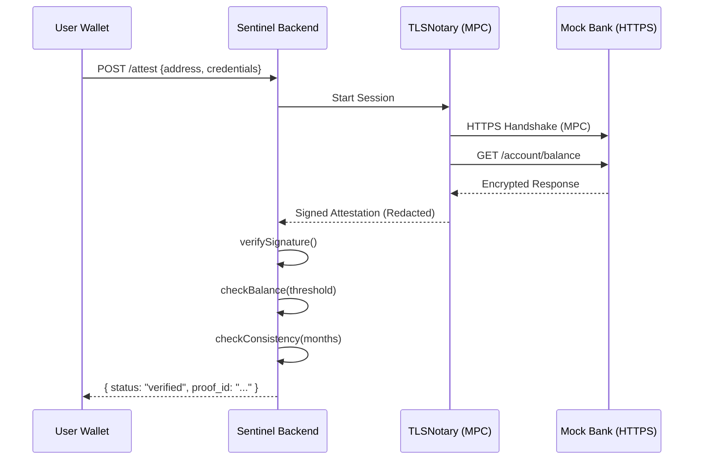

# zkTLS Engine Implementation Details

This document defines the technical implementation of the zkTLS Attestation Engine for Phase 2 of Project Sentinel.

## 1. API Contracts

All endpoints communicate via `application/json`. Errors follow the standard format defined in Section 4.

### Mock Bank API (HTTPS)
| Endpoint | Method | Auth | Description |
| :--- | :--- | :--- | :--- |
| `/auth/login` | POST | None | Authenticates user, returns JWT. |
| `/account/balance` | GET | JWT | Returns current balance and user metadata. |
| `/account/transactions` | GET | JWT | Returns transaction history for the last 4 months. |

**POST /auth/login**
- **Request Body:** `{ "username": "user_pass", "password": "sentinel123" }`
- **Response (200):** `{ "token": "eyJ...", "expires_in": 3600 }`
- **Error (401):** `{ "error": "INVALID_CREDENTIALS", "message": "Username or password incorrect" }`

**GET /account/balance**
- **Headers:** `Authorization: Bearer <token>`
- **Response (200):** 
  ```json
  {
    "account_id": "ACC-001",
    "balance": 25000,
    "currency": "USD",
    "last_updated": "2026-02-18T12:00:00Z"
  }
  ```

### Sentinel Attestation API
| Endpoint | Method | Description |
| :--- | :--- | :--- |
| `/attest` | POST | Initiates TLSNotary session and generates attestation. |
| `/attest/:id` | GET | Retrieves stored attestation status and data. |
| `/verify/:id` | POST | Runs backend verification (sig, balance, consistency). |

**POST /attest**
- **Request Body:** `{ "user_address": "0x123...", "username": "user_pass", "password": "..." }`
- **Response (201):** `{ "attestation_id": "uuid-v4", "status": "pending" }`

---

## 2. TypeScript Interfaces

```typescript
export interface User {
  id: string;
  username: string;
  passwordHash: string;
  address: string;
}

export interface BankAccount {
  accountId: string;
  balance: number;
  currency: string;
}

export interface Transaction {
  date: string;
  amount: number;
  type: 'credit' | 'debit';
  description: string;
}

export interface TransactionSummary {
  months: {
    month: string; // YYYY-MM
    tx_count: number;
  }[];
}

export interface DisclosedData {
  balance: number;
  currency: string;
  account_id_hash: string;
  transactions_summary: TransactionSummary;
}

export interface NotaryKeyPair {
  publicKey: string;
  privateKey?: string;
}

export interface Attestation {
  id: string;
  user_address: string;
  timestamp: string;
  notary: {
    signature: string;
    public_key: string;
  };
  disclosed_data: DisclosedData;
  status: 'pending' | 'verified' | 'failed';
  error?: string;
}

export interface VerificationConfig {
  balanceThreshold: number;
  minTxPerMonth: number;
  consistencyMonths: number;
}

export interface VerificationResult {
  isValid: boolean;
  errors: string[];
  timestamp: string;
}

export interface JWTPayload {
  sub: string; // username
  iat: number;
  exp: number;
}
```

---

## 3. File-by-File Guide

### Mock Bank Server (`mock-bank/`)

- **server.ts**: Entry point. Sets up HTTPS using `certs/server.key` and `certs/server.cert`.
- **certs/generate.sh**: Shell script using `openssl` to generate self-signed certs for local HTTPS.
- **certs/notary-key.ts**: Exports `NOTARY_PUB_KEY` and `NOTARY_PRIV_KEY` (simulating the TLSNotary MPC node).
- **routes/auth.ts**: Handles `/auth/login`. Uses `jsonwebtoken` to sign payloads.
- **routes/account.ts**: Protected routes. Fetches data from `users.json` based on JWT `sub`.
- **data/users.json**: Static DB with 3 users (Pass, FailBalance, FailConsistency).

### Attestation Engine (`app/src/attestation/`)

- **notary.ts**: Main orchestration. 
  - *Logic:* Initialize `tlsn-js`, perform MPC handshake with Mock Bank, handle selective disclosure.
- **disclosure.ts**: 
  - *Logic:* Redacts the `Authorization` header and raw PII; reveals `balance` and tx metadata.
- **bind.ts**: 
  - *Logic:* Injects `user_address` into the proof metadata to prevent "proof reuse" by other wallets.
- **storage.ts**: 
  - *Logic:* Uses `fs/promises` to save/load attestations from `data/attestations/*.json`.

### Backend Verifier (`app/src/verifier/`)

- **signature.ts**: 
  - *Logic:* Verifies the `notary.signature` using `elliptic` (secp256k1) against the known Notary public key.
- **balance.ts**: 
  - *Logic:* `if (data.balance < config.balanceThreshold) throw Error`.
- **consistency.ts**: 
  - *Logic:* Iterates through `transactions_summary.months`. Validates `tx_count >= minTxPerMonth` for the last `N` months.
- **index.ts**: 
  - *Logic:* Aggregates checks. Updates the `.json` status to `verified`.

---

## 4. Error Handling

Standard response for all 4xx/5xx errors:
```json
{
  "error": "ERROR_CODE",
  "message": "Human readable message",
  "details": {} 
}
```
**Recovery Patterns:**
- **TLS Handshake Failure:** Retry up to 3 times with exponential backoff.
- **Invalid Signature:** Immediately mark attestation as `failed`.
- **Mock Bank Offline:** Verifier returns `503 Service Unavailable`.

---

## 5. Configuration

Configuration is managed via `app/src/config.ts` and environment variables.

| Parameter | Env Var | Default | Description |
| :--- | :--- | :--- | :--- |
| `balanceThreshold` | `BALANCE_THRESHOLD` | `1000` | Minimum balance in USD. |
| `minTxPerMonth` | `MIN_TX_PER_MONTH` | `3` | Required activity per month. |
| `consistencyMonths` | `CONSISTENCY_MONTHS` | `3` | Months to check back. |

The `verifier/index.ts` reads these values and passes them to the balance and consistency modules.

---

## 6. Testing Matrix

| Component | Test Case | Input | Expected Output |
| :--- | :--- | :--- | :--- |
| **Auth** | Valid Login | `user_pass`, `sentinel123` | JWT Token + 200 OK |
| **Auth** | Bad Password | `user_pass`, `wrong` | 401 Unauthorized |
| **Verifier** | Balance Check Pass | `balance: 2000`, `thresh: 1000` | `isValid: true` |
| **Verifier** | Balance Check Fail | `balance: 500`, `thresh: 1000` | `isValid: false` |
| **Consistency** | Active User | 5, 4, 6 txs (min 3) | `isValid: true` |
| **Consistency** | Inactive User | 5, 1, 6 txs (min 3) | `isValid: false` |
| **Signature** | Correct Sig | Notary signed payload | `isValid: true` |
| **Signature** | Tampered Data | Modified balance value | `isValid: false` |

---

## 7. Security

1. **JWT Validation:** Mock Bank routes use `express-jwt` middleware.
2. **TLS Certificates:** `generate.sh` creates 2048-bit RSA keys. `tlsn-js` validates the bank's certificate chain.
3. **Selective Disclosure:** The `disclosure.ts` logic ensures the `cookie` or `Bearer` token never leaves the MPC session in plain text.
4. **Input Sanitization:** `user_address` is validated as a 42-character hex string (0x...).

---

## 8. Build & Run Commands

```bash
# 1. Setup
npm install

# 2. Generate Bank TLS Certs
cd mock-bank/certs && bash generate.sh

# 3. Start Mock Bank (Terminal 1)
npm run bank:start 
# (Runs: tsx mock-bank/server.ts)

# 4. Run Attestation (Terminal 2)
npm run attest -- --user 0x123... --bank_user user_pass

# 5. Run Verification
npm run verify -- --id <attestation_id>

# 6. Run All Tests
npm test
```

---

## 9. Service Architecture Diagram


