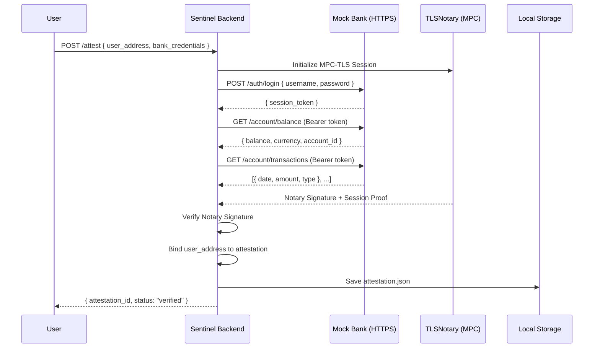
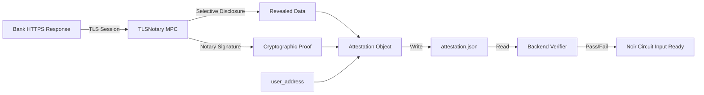
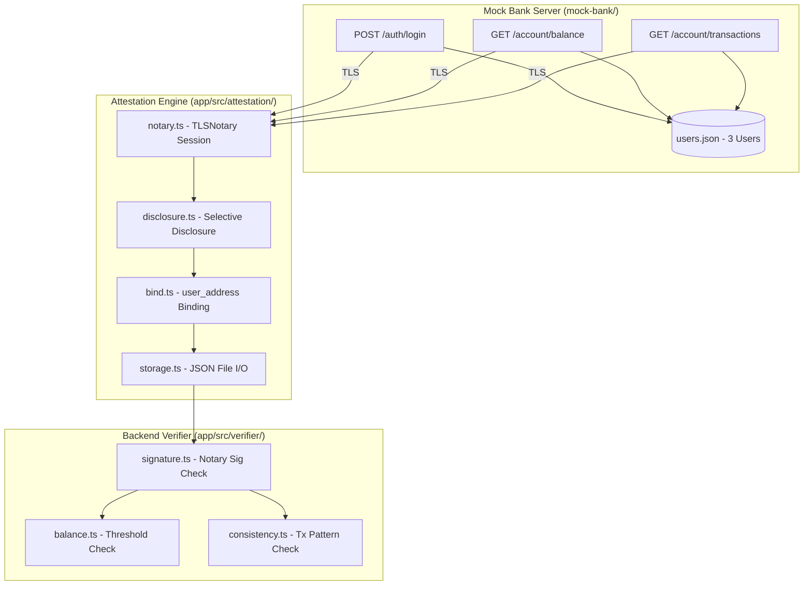

# zkTLS Implementation Plan — Project Sentinel (Phase 2)

## 1. Overview

This phase builds the **zkTLS Attestation Engine** — the cryptographic bridge that turns private Web2 banking data into a verifiable, privacy-preserving claim. The engine proves a user's financial health (balance and transaction consistency) without leaking PII.

**Key Decisions:**
- **Provider:** TLSNotary (MPC-based, no trusted third party sees user data)
- **Verification:** Off-circuit (TypeScript backend verifies Notary signature; Noir circuit handles business logic only)
- **Storage:** Plain `.json` files (local)
- **Runtime:** Node 24
- **Parameters:** Balance threshold and transaction consistency are **configurable in the Noir circuit**

---

## 2. Architecture

### 2.1 System Flow



### 2.2 Data Flow (Attestation Lifecycle)



### 2.3 Component Architecture



---

## 3. Component Design

### 3.1 Mock Bank Server (`mock-bank/`)

| File | Responsibility |
| :--- | :--- |
| `mock-bank/certs/generate.sh` | Generates self-signed TLS certificates for HTTPS |
| `mock-bank/server.ts` | Express.js HTTPS server with JWT-based auth |
| `mock-bank/routes/auth.ts` | `POST /auth/login` — validates credentials, returns JWT |
| `mock-bank/routes/account.ts` | `GET /account/balance` and `GET /account/transactions` |
| `mock-bank/data/users.json` | Seed data for 3 test users |

#### Seed Users

| User | Balance | Monthly Txs (last 3mo) | Expected Result |
| :--- | :--- | :--- | :--- |
| `user_pass` | $25,000 | 5, 7, 4 | ✅ Pass all checks |
| `user_fail_balance` | $500 | 6, 5, 8 | ❌ Fail balance (<$1000) |
| `user_fail_consistency` | $15,000 | 1, 0, 1 | ❌ Fail consistency |

#### API Schema

**POST /auth/login**
```json
// Request
{ "username": "user_pass", "password": "sentinel123" }
// Response
{ "token": "eyJ...", "expires_in": 3600 }
```

**GET /account/balance**
```json
{
  "account_id": "ACC-001",
  "balance": 25000,
  "currency": "USD",
  "user_address": "0x1234...abcd",
  "last_transaction_date": "2026-02-15T10:30:00Z"
}
```

**GET /account/transactions**
```json
{
  "transactions": [
    { "date": "2026-02-15T10:30:00Z", "amount": 150.00, "type": "debit", "description": "Grocery" },
    { "date": "2026-02-14T08:00:00Z", "amount": 3500.00, "type": "credit", "description": "Salary" }
  ],
  "period": { "from": "2025-11-18", "to": "2026-02-18" },
  "total_count": 18
}
```

### 3.2 Attestation Engine (`app/src/attestation/`)

| File | Responsibility |
| :--- | :--- |
| `notary.ts` | Initializes TLSNotary MPC session, orchestrates the TLS handshake with the Mock Bank |
| `disclosure.ts` | Defines which fields are revealed (balance, txs) and which are redacted (auth headers, cookies) |
| `bind.ts` | Appends the `user_address` (EVM address) to the attestation payload before signing |
| `storage.ts` | Writes/reads attestation `.json` files to `data/attestations/` |

#### Attestation Object Schema
```json
{
  "id": "att-uuid-v4",
  "user_address": "0x1234...abcd",
  "timestamp": "2026-02-18T16:30:00Z",
  "notary": {
    "signature": "0xabc...def",
    "public_key": "0x04..."
  },
  "disclosed_data": {
    "balance": 25000,
    "currency": "USD",
    "account_id_hash": "0xsha256...",
    "transactions_summary": {
      "months": [
        { "month": "2025-12", "tx_count": 5 },
        { "month": "2026-01", "tx_count": 7 },
        { "month": "2026-02", "tx_count": 4 }
      ]
    }
  },
  "status": "pending_verification"
}
```

### 3.3 Backend Verifier (`app/src/verifier/`)

| File | Responsibility |
| :--- | :--- |
| `signature.ts` | Verifies the TLSNotary signature against the known Notary public key |
| `balance.ts` | Checks `balance >= threshold` (default: $1000, configurable) |
| `consistency.ts` | Checks `tx_count >= min_txs` for each of the last `N` months (both configurable) |
| `index.ts` | Orchestrates all checks, updates attestation status to `verified` or `failed` |

#### Configurable Parameters
```typescript
interface VerificationConfig {
  balanceThreshold: number;      // Default: 1000 (USD)
  minTxPerMonth: number;         // Default: 3
  consistencyMonths: number;     // Default: 3
}
```

### 3.4 Temporary ECDSA Key Pair (Mock Notary)

For the hackathon, we simulate the TLSNotary signature with a local ECDSA key pair.

| File | Responsibility |
| :--- | :--- |
| `mock-bank/certs/notary-key.ts` | Generates and exports a temporary `secp256k1` key pair |

---

## 4. Testing Strategy

| Test File | Scope | Type |
| :--- | :--- | :--- |
| `app/test/mock-bank.test.ts` | Mock Bank endpoints (auth, balance, transactions) | Unit |
| `app/test/attestation.test.ts` | Attestation generation and storage | Integration |
| `app/test/verifier.test.ts` | Signature, balance, and consistency checks | Unit |
| `app/test/e2e.test.ts` | Full flow: Login → Attest → Store → Verify | E2E |

**Framework:** Vitest (Node 24 native, fast, ESM-first)

---

## 5. Build Sequence

- [ ] **Phase 2.1 — Mock Bank Server**
  - [ ] Generate self-signed TLS certs
  - [ ] Implement Express HTTPS server
  - [ ] Create auth, balance, and transaction routes
  - [ ] Seed 3 test users
  - [ ] Write unit tests for all endpoints

- [ ] **Phase 2.2 — Attestation Engine**
  - [ ] Generate temporary ECDSA key pair (Mock Notary)
  - [ ] Implement TLSNotary session orchestration
  - [ ] Implement selective disclosure logic
  - [ ] Implement user_address binding
  - [ ] Implement JSON file storage
  - [ ] Write integration tests

- [ ] **Phase 2.3 — Backend Verifier**
  - [ ] Implement signature verification
  - [ ] Implement balance threshold check (configurable)
  - [ ] Implement transaction consistency check (configurable)
  - [ ] Write unit tests for each check
  - [ ] Write E2E test for the full pipeline

- [ ] **Phase 2.4 — Documentation**
  - [ ] Excalidraw architecture diagram
  - [ ] Document future improvements

---

## 6. Dependencies

```json
{
  "dependencies": {
    "express": "^5.0.0",
    "jsonwebtoken": "^9.0.0",
    "elliptic": "^6.6.0",
    "uuid": "^11.0.0",
    "tlsn-js": "latest"
  },
  "devDependencies": {
    "vitest": "^3.0.0",
    "typescript": "^5.7.0",
    "@types/express": "^5.0.0",
    "@types/jsonwebtoken": "^9.0.0",
    "@types/node": "^22.0.0",
    "tsx": "^4.0.0"
  }
}
```

---

## 7. Future Improvements (Post-Hackathon)

| Improvement | Description | Priority |
| :--- | :--- | :--- |
| **Encryption at Rest** | AES-256-GCM encryption for attestation `.json` files | High |
| **On-Circuit Signature Verification** | Move Notary signature check into Noir circuit for full trustlessness | High |
| **Real TLSNotary Integration** | Replace mock notary with actual TLSNotary MPC network | Critical |
| **Reclaim SDK Fallback** | Add Reclaim as an alternative zkTLS provider for portals that block MPC proxies | Medium |
| **Database Storage** | Replace local `.json` with PostgreSQL or SQLite for production | Medium |
| **Rate Limiting & Abuse Prevention** | Throttle attestation requests per user_address | Medium |
| **Multi-Bank Support** | Abstract the bank API schema to support multiple providers via config | Low |
| **Attestation Expiry** | Auto-invalidate attestations older than N days | Low |
